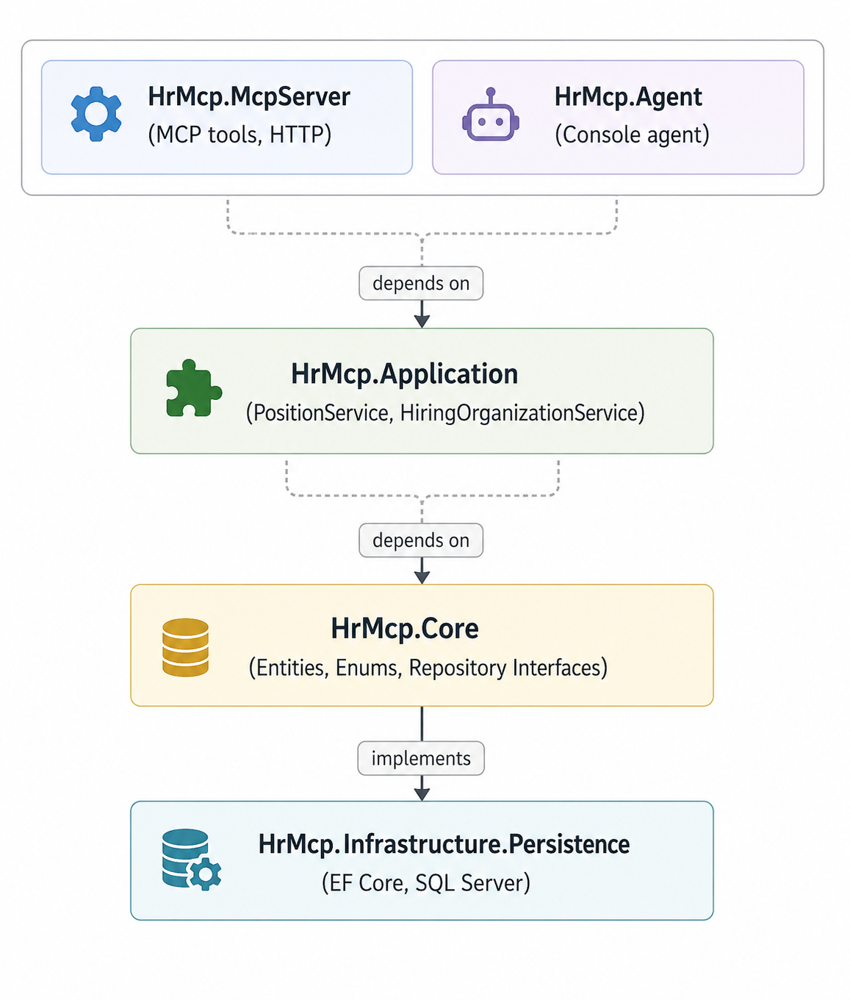

# Part 1: Clean Architecture Foundation with HR Domain

**Series:** [AI Agents & MCP with .NET 10](preface.md) | **Part 1 of 6**  
**GitHub:** [workcontrolgit/DotnetAiAgentMcp](https://github.com/workcontrolgit/DotnetAiAgentMcp)


---

## Introduction

Before we wire up MCP transports, AI agents, and export workflows, we need a domain that is worth exposing. In this first post, we build the Clean Architecture base for a federal HR system modeled on **USAJobs.gov**.

The current codebase has moved well beyond the original small demo. It now includes:

- a 5-project .NET 10 solution
- a richer USAJobs-aligned domain model
- EF Core 9 persistence with multiple migrations
- JSON-backed seed data from `data/usajobs-seed.json`
- a fallback in-code seed for clean local startup

As of the current repository state, the checked-in seed file contains **1 organization and 41 positions**, and the fallback code seed contains the earlier **4 organizations and 5 positions**.

By the end of this post you will understand the actual project structure the rest of the series builds on.

---

## Why Clean Architecture Here

The key idea is simple: your HR domain should not know anything about MCP, ASP.NET Core, Ollama, Azure OpenAI, or export formats.

In this solution:

- `HrMcp.Core` owns entities, enums, and repository contracts
- `HrMcp.Application` owns use-case services
- `HrMcp.Infrastructure.Persistence` owns EF Core and SQL Server
- `HrMcp.McpServer` owns transport, tool registration, auth, and hosting
- `HrMcp.Agent` owns client-side AI orchestration

That separation is what lets the same domain data power:

- MCP query tools
- MCP export tools
- a console AI agent
- local `stdio` clients like Claude Desktop
- hosted HTTP MCP endpoints



---

## The Solution Shape

The actual solution file currently contains these projects:

```xml
<Solution>
  <Folder Name="/src/">
    <Project Path="src/HrMcp.Agent/HrMcp.Agent.csproj" />
    <Project Path="src/HrMcp.Application/HrMcp.Application.csproj" />
    <Project Path="src/HrMcp.Core/HrMcp.Core.csproj" />
    <Project Path="src/HrMcp.Infrastructure.Persistence/HrMcp.Infrastructure.Persistence.csproj" />
    <Project Path="src/HrMcp.McpServer/HrMcp.McpServer.csproj" />
  </Folder>
</Solution>
```

That gives us:

- `HrMcp.Core`
- `HrMcp.Application`
- `HrMcp.Infrastructure.Persistence`
- `HrMcp.McpServer`
- `HrMcp.Agent`

The dependency direction still flows inward toward `Core`.

---

## Step 1 - Core Domain (`HrMcp.Core`)

`HrMcp.Core` has no infrastructure dependency. It contains:

```text
src/HrMcp.Core/
  Entities/
    HiringOrganization.cs
    Position.cs
    PositionRemuneration.cs
  Enums/
    AppointmentType.cs
    WorkSchedule.cs
    SecurityClearance.cs
    TravelRequirement.cs
  Interfaces/
    IHiringOrganizationRepository.cs
    IPositionRepository.cs
```

### `HiringOrganization`

`HiringOrganization` is still simple and stable:

```csharp
public class HiringOrganization
{
    public int Id { get; set; }
    public string OrganizationName { get; set; } = string.Empty;
    public string DepartmentName { get; set; } = string.Empty;
    public string AgencyDescription { get; set; } = string.Empty;
    public ICollection<Position> Positions { get; set; } = [];
}
```

### `Position`

`Position` is where most of the evolution happened. The current code maps far more of the USAJobs surface than the early draft did.

Representative categories now include:

- identity: `AnnouncementNumber`, `UsaJobsId`, `PositionUri`, `ApplyUri`, `Title`
- narrative: `Description`, `Duties`, `Qualifications`, `Education`, `Evaluations`
- classification: `OccupationalSeries`, `OccupationalSeriesTitle`, `ServiceType`, `SubAgencyName`
- logistics: `DutyLocation`, `DutyLocationState`, `TeleworkEligible`, `RemoteEligible`
- process: `WhoMayApply`, `HiringPath`, `HowToApply`, `NextSteps`, `RequiredDocuments`
- compliance: `SecurityClearance`, `DrugTestRequired`, `FinancialDisclosure`, `PositionSensitivityAndRisk`
- contact: `ContactName`, `ContactPhone`, `ContactEmail`, `ContactAddress`

That richer schema is why later parts can support:

- full detail query tools
- USAJobs-style HTML rendering
- Word export
- Excel export

The current entity is much closer to a real USAJobs posting than the earlier minimal model.

### `PositionRemuneration`

`PositionRemuneration` remains a separate entity with a one-to-one relationship:

```csharp
public class PositionRemuneration
{
    public int Id { get; set; }
    public decimal MinimumRange { get; set; }
    public decimal MaximumRange { get; set; }
    public string RateIntervalCode { get; set; } = "PA";
    public string Description { get; set; } = "Per Year";
    public int PositionId { get; set; }
    public Position Position { get; set; } = null!;
}
```

### Repository Contracts

The repository interfaces are still intentionally narrow:

```csharp
public interface IPositionRepository
{
    Task<IEnumerable<Position>> GetAllAsync(CancellationToken ct = default);
    Task<IEnumerable<Position>> GetOpenPositionsAsync(CancellationToken ct = default);
    Task<Position?> GetByIdAsync(int id, CancellationToken ct = default);
    Task<IEnumerable<Position>> GetByOrganizationAsync(int organizationId, CancellationToken ct = default);
}
```

```csharp
public interface IHiringOrganizationRepository
{
    Task<IEnumerable<HiringOrganization>> GetAllAsync(CancellationToken ct = default);
    Task<HiringOrganization?> GetByIdAsync(int id, CancellationToken ct = default);
}
```

They expose the use cases the application layer actually needs, not a generic CRUD abstraction.

---

## Step 2 - Application Layer (`HrMcp.Application`)

The application layer is still intentionally thin:

```text
src/HrMcp.Application/
  Services/
    PositionService.cs
    HiringOrganizationService.cs
```

Current service shape:

```csharp
public class PositionService(IPositionRepository repo)
{
    public Task<IEnumerable<Position>> GetAllPositionsAsync(CancellationToken ct = default)
        => repo.GetAllAsync(ct);

    public Task<IEnumerable<Position>> GetOpenPositionsAsync(CancellationToken ct = default)
        => repo.GetOpenPositionsAsync(ct);

    public Task<Position?> GetPositionByIdAsync(int id, CancellationToken ct = default)
        => repo.GetByIdAsync(id, ct);

    public Task<IEnumerable<Position>> GetPositionsByOrganizationAsync(int organizationId, CancellationToken ct = default)
        => repo.GetByOrganizationAsync(organizationId, ct);
}
```

```csharp
public class HiringOrganizationService(IHiringOrganizationRepository repo)
{
    public Task<IEnumerable<HiringOrganization>> GetAllOrganizationsAsync(CancellationToken ct = default)
        => repo.GetAllAsync(ct);

    public Task<HiringOrganization?> GetOrganizationByIdAsync(int id, CancellationToken ct = default)
        => repo.GetByIdAsync(id, ct);
}
```

This is enough for the MCP server to expose data tools cleanly without leaking EF Core into the transport layer.

---

## Step 3 - Persistence Layer (`HrMcp.Infrastructure.Persistence`)

The persistence project currently references EF Core 9:

```xml
<PackageReference Include="Microsoft.EntityFrameworkCore.Design" Version="9.*" />
<PackageReference Include="Microsoft.EntityFrameworkCore.SqlServer" Version="9.*" />
```

Its main pieces are:

```text
src/HrMcp.Infrastructure.Persistence/
  DependencyInjection.cs
  DbSeeder.cs
  HrDbContext.cs
  Repositories/
    HiringOrganizationRepository.cs
    PositionRepository.cs
  Migrations/
    20260426123747_InitialCreate.cs
    20260515110901_AddPositionFields.cs
    20260515112526_AddQualificationFields.cs
    20260515113005_AddUsaJobsId.cs
    20260515113551_AddAdjudicationAndRemoteFields.cs
    20260516114132_AddContactAndApplicationFields.cs
```

Those migration names tell the story clearly: the model expanded incrementally as the project moved from a minimal demo to a more complete USAJobs-aligned schema.

### `HrDbContext`

The current `HrDbContext` is still compact:

```csharp
public class HrDbContext(DbContextOptions<HrDbContext> options) : DbContext(options)
{
    public DbSet<HiringOrganization> HiringOrganizations => Set<HiringOrganization>();
    public DbSet<Position> Positions => Set<Position>();
    public DbSet<PositionRemuneration> PositionRemunerations => Set<PositionRemuneration>();

    protected override void OnModelCreating(ModelBuilder modelBuilder)
    {
        modelBuilder.Entity<PositionRemuneration>()
            .Property(r => r.MinimumRange).HasPrecision(18, 2);
        modelBuilder.Entity<PositionRemuneration>()
            .Property(r => r.MaximumRange).HasPrecision(18, 2);

        modelBuilder.Entity<PositionRemuneration>()
            .HasOne(r => r.Position)
            .WithOne(p => p.PositionRemuneration)
            .HasForeignKey<PositionRemuneration>(r => r.PositionId);
    }
}
```

### Dependency Registration

Persistence is wired through an extension method:

```csharp
public static IServiceCollection AddPersistence(
    this IServiceCollection services,
    string connectionString)
{
    services.AddDbContext<HrDbContext>(options =>
        options.UseSqlServer(connectionString));

    services.AddScoped<IPositionRepository, PositionRepository>();
    services.AddScoped<IHiringOrganizationRepository, HiringOrganizationRepository>();

    return services;
}
```

That keeps EF-specific registration out of `Core` and `Application`.

### Repositories

The repositories use eager loading because the downstream MCP tools need both organization and remuneration data:

```csharp
private IQueryable<Position> BaseQuery =>
    db.Positions
      .Include(p => p.HiringOrganization)
      .Include(p => p.PositionRemuneration);
```

That is a pragmatic choice for this tutorial-sized system: the query layer is simple, and the transport layer gets complete objects to project into MCP tool results.

---

## Step 4 - Seeding Strategy

This is one of the biggest places where the codebase changed.

The current `DbSeeder` supports:

- JSON-backed seeding from `data/usajobs-seed.json`
- fallback hard-coded seed data
- optional forced reseed with existing data cleared first

Current entry point:

```csharp
public static void Seed(HrDbContext db, string? jsonSeedPath = null, bool force = false)
```

### Primary path: JSON seed

If `jsonSeedPath` exists, the seeder loads:

- organizations from the JSON file
- positions from the JSON file
- expanded USAJobs fields such as `AnnouncementNumber`, `UsaJobsId`, `HiringPath`, `HowToApply`, `NextSteps`, `RequiredDocuments`, and contact metadata

In the current repository state:

- `data/usajobs-seed.json` contains `1` organization
- `data/usajobs-seed.json` contains `41` positions

That means the blog should no longer describe the project as shipping only a tiny hand-curated dataset.

### Fallback path: in-code seed

If the JSON file is missing, `DbSeeder` falls back to the earlier in-code demo data:

- 4 organizations
- 5 positions

That fallback is still useful because it guarantees the app can boot on a clean machine even if the JSON data file is absent.

### Why this matters

This two-path seeding approach gives you:

- realism when the JSON dataset is present
- resilience when it is not

It also explains why later parts can demo richer tool responses without requiring a live USAJobs API call at runtime.

---

## Step 5 - What This Foundation Enables

Because the codebase now holds much more than title, duties, and salary, the later parts can expose meaningful MCP workflows:

- query all open positions
- filter by organization
- drill into full position details
- render a position as USAJobs-style HTML
- export a position to Word
- export all open positions to Excel

That is the practical benefit of keeping the domain model honest and reasonably complete.

---

## What We Built

- `HrMcp.Core` with expanded USAJobs-aligned entities, enums, and repository contracts
- `HrMcp.Application` with thin use-case services
- `HrMcp.Infrastructure.Persistence` with EF Core 9, repositories, and multiple schema migrations
- JSON-backed seeding from `data/usajobs-seed.json`
- fallback in-code seeding for clean local startup
- a domain base that later supports both MCP query tools and MCP export tools

The AI still knows nothing about this. That is exactly the point. We now have a clean, stable domain surface that the MCP server can expose in Part 3 and the agent can consume in Part 4.

---

## Next Up

**[Part 2: Introduction to Model Context Protocol ->](part-2-intro-to-mcp.md)**

Before we expose any of this over MCP, we step back and build the mental model: what MCP is, what problem it solves, and how it maps to patterns .NET developers already understand.

---

## Sources

- [USAJobs.gov Developer API Reference](https://developer.usajobs.gov/api-reference/)
- [USAJobs Help](https://help.usajobs.gov/)
- [Entity Framework Core SQL Server Provider](https://www.nuget.org/packages/Microsoft.EntityFrameworkCore.SqlServer)
