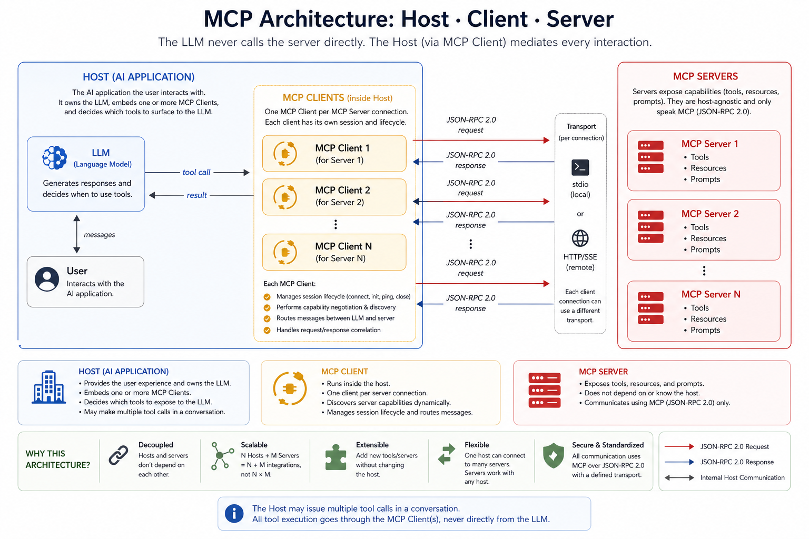

# Part 2: Introduction to Model Context Protocol

**Series:** [AI Agents & MCP with .NET 10](preface.md) | **Part 2 of 6**  
**GitHub:** [workcontrolgit/DotnetAiAgentMcp](https://github.com/workcontrolgit/DotnetAiAgentMcp)

---

## Introduction

In Part 1 we built a Clean Architecture HR domain. The entities, services, and seed data are in place. But an AI still cannot reach any of it yet.

That is what Model Context Protocol (MCP) gives us: a standard way for AI hosts to discover capabilities and call into external systems without every host inventing its own private integration.

Before we write any MCP server code in Part 3, this post builds the mental model. No implementation details first. Just the protocol, the roles, and why it matters for this .NET solution.

---

## The Integration Problem

Without a shared protocol, every AI host needs a custom integration for every system it wants to access.

If you have:

- multiple AI hosts: Claude Desktop, a console agent, an IDE extension
- multiple systems: a database, a file export service, a REST API, a document store

then you get the classic **N x M** problem.

MCP reduces that to **N + M**:

- each host implements the MCP client once
- each system implements the MCP server once

After that, any compatible host can talk to any compatible server through the same protocol.

That is the value proposition in one sentence: **standardize the connection surface, not the model vendor or the app framework**.

---

## What MCP Is

MCP is an open protocol for exposing capabilities to AI hosts.

It standardizes:

- how a client connects to a server
- how capabilities are described
- how requests and responses are exchanged
- how tools are invoked
- how structured results come back

In practical terms, it is the layer between:

- the **AI host** the user talks to
- the **server** that knows how to query data or perform actions

The important consequence: the server does not need to know whether the caller is Claude Desktop, a .NET agent, or some future MCP-compatible host.

---

## MCP Primitives

MCP defines three main capability types.

### Tools

Tools are the most important primitive in this series.

They are callable functions with:

- a name
- a description
- structured inputs
- a structured or textual output

In this repo, tools include:

- `GetHiringOrganizations`
- `GetOpenPositions`
- `GetPositionById`
- `GetPositionsByOrganization`
- `ExportPositionToHtml`
- `ExportPositionToWord`
- `ExportDraftToWord`
- `ExportPositionsToExcel`

That list is important because it shows MCP tools are not just read operations. Some tools fetch data; others package that data into exports.

### Resources

Resources are read-only content exposed by address, usually via URIs.

This repo does not currently use MCP resources, but conceptually they fit things like:

- policy documents
- schemas
- markdown references
- configuration snapshots

Resources give the model information. They do not perform actions.

### Prompts

Prompts are reusable server-side templates a client can request and inject into a conversation.

This repo does not currently expose prompts either, but they would be useful for things like:

- federal job-announcement formatting guidance
- reusable system prompt fragments
- standardized drafting instructions

Prompts keep domain-specific instructions close to the server instead of duplicating them in every host.

---

## Roles in an MCP Interaction

There are three roles:

### Host

The host is the application the user interacts with.

Examples:

- Claude Desktop
- the `HrMcp.Agent` console app in this repo
- an IDE-integrated AI assistant

The host owns the conversation and decides which model to run.

### Client

The client is the MCP component inside the host.

Its job is to:

- connect to one MCP server
- negotiate capabilities
- send tool calls
- receive tool results

In this repo, the .NET agent uses the MCP C# client to connect over either `stdio` or Streamable HTTP.

### Server

The server exposes capabilities.

In this repo, that is `HrMcp.McpServer`.

Its job is to:

- register tools
- receive MCP requests
- execute the corresponding application service or export logic
- return results in the MCP contract

The server does not manage the chat conversation. It only handles capability calls.

---

## What Actually Flows

The model does **not** directly talk to the database or the MCP server.

The flow looks like this:

1. The user asks a question in the host.
2. The host sends conversation context to the LLM.
3. The LLM decides it needs a tool.
4. The host routes that tool request through its MCP client.
5. The MCP client sends the request to the MCP server.
6. The server executes the tool and returns the result.
7. The host feeds that result back to the LLM.
8. The LLM produces the final user-facing answer.

That indirection matters because it keeps authority in the host. The model suggests tool calls; the host and client execute them.

---

## Transports

The current repo supports two transport modes.

### `stdio`

`stdio` is the right fit when the MCP client and MCP server live on the same machine and the client can launch the server as a local process.

That is the normal shape for local desktop clients such as:

- Claude Desktop
- other local MCP-aware desktop hosts

Why it is useful:

- no open network port required
- no reverse proxy required
- simple local process lifecycle
- good security default for local-only usage

Critical rule:

- **stdout must contain only MCP protocol traffic**

Logs and diagnostics must go to stderr, not stdout. The current `HrMcp.McpServer` code handles this explicitly in `stdio` mode.

### Streamable HTTP

The repo also supports Streamable HTTP for hosted/server scenarios.

This is the right fit when:

- the server runs as a long-lived web service
- the client is not responsible for launching the process
- you want a stable URL like `http://localhost:5100/mcp` or `https://your-host/mcp`
- you want HTTP middleware, auth, reverse proxies, or remote access

In the current repo, this mode is also where OIDC becomes relevant. The HTTP-hosted MCP endpoint can be protected with bearer-token authentication, and the agent can acquire a token and send it along.

### Current repo behavior

Today the solution supports both:

- `HrMcp.McpServer` can run in `stdio` mode or HTTP mode
- `HrMcp.Agent` can connect over `stdio` or Streamable HTTP

That is important because it mirrors real usage:

- local desktop client: usually `stdio`
- hosted MCP service: usually HTTP

---

## MCP vs REST

REST APIs already expose capabilities, so why use MCP?

Because REST gives you endpoints, but not an AI-native capability layer.

With REST, the host still needs to know:

- endpoint URLs
- authentication details
- request shapes
- how to turn operations into tool metadata the model can reason about

MCP sits one layer above that. It gives the host:

- discoverable tools
- descriptions
- argument schemas
- a uniform invocation model

That is why the same host can talk to multiple MCP servers consistently even if those servers wrap very different backends.

---

## MCP vs Provider-Specific Function Calling

Model vendors already support function calling, but that is not the same thing as MCP.

Provider-specific function calling:

- is tied to a specific model API
- lives inside one application’s prompt/request flow
- does not standardize how external systems are exposed across hosts

MCP:

- is vendor-neutral
- is host-to-server protocol level
- works across different clients and different model providers

In this repo, that distinction matters because:

- the server is independent of Ollama vs Azure OpenAI
- the agent can swap model providers
- the same server can also be consumed by a local client like Claude Desktop

---

## What This Means for This Project

In this codebase, MCP is the layer that turns the HR domain into a reusable AI-facing surface.

Without MCP:

- the agent would need custom code for every data/export operation
- Claude Desktop would need a separate integration path
- hosted HTTP and local `stdio` flows would diverge more than necessary

With MCP:

- the server exposes one standard set of tools
- the agent consumes them through the MCP client
- local and hosted access differ mostly by transport, not by business logic

That is the architectural win.

---

## Preview of Part 3

Part 3 wires the MCP SDK into `HrMcp.McpServer` and exposes the current tool surface:

**Data tools**

- `GetHiringOrganizations`
- `GetOpenPositions`
- `GetPositionById`
- `GetPositionsByOrganization`

**Export tools**

- `ExportPositionToHtml`
- `ExportPositionToWord`
- `ExportDraftToWord`
- `ExportPositionsToExcel`

It also supports both:

- `stdio` for local clients
- Streamable HTTP for hosted or inspector-based access

After that, MCP Inspector can connect directly to the server and call the tools without any AI host involved.

---

## Next Up

**[Part 3: Building an MCP Server in .NET 10 ->](part-3-mcp-server-dotnet.md)**

We register the MCP server in .NET, expose the HR and export tools, support both transports, and verify the whole surface with MCP Inspector.

---

## Sources

- [Model Context Protocol - Official Documentation](https://modelcontextprotocol.io/introduction)
- [MCP Specification](https://spec.modelcontextprotocol.io/)
- [ModelContextProtocol C# SDK - GitHub](https://github.com/modelcontextprotocol/csharp-sdk)
- [ModelContextProtocol NuGet Package](https://www.nuget.org/packages/ModelContextProtocol)
