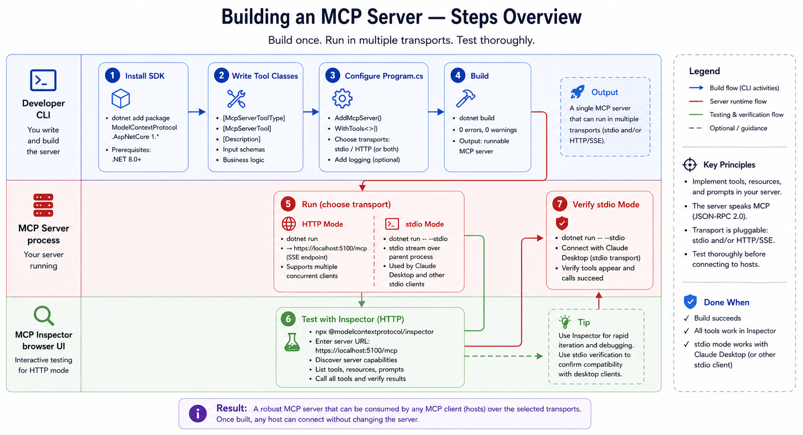
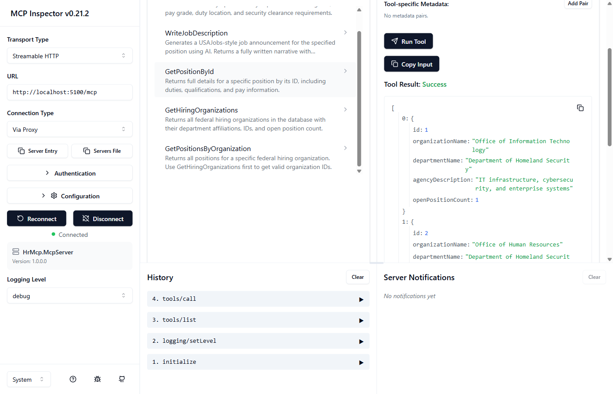

# Part 3: Building an MCP Server in .NET 10

**Series:** [AI Agents & MCP with .NET 10](preface.md) | **Part 3 of 6**  
**GitHub:** [workcontrolgit/DotnetAiAgentMcp](https://github.com/workcontrolgit/DotnetAiAgentMcp)


---

## Introduction

In Part 2 we built the mental model for MCP. In this part we make it real.

By the end of this post you will have a running MCP server that exposes both **data tools** and **export tools**, supports `stdio` transport for local MCP clients such as Claude Desktop, and can be tested interactively with MCP Inspector without any AI host involved.

The server lives in `HrMcp.McpServer`, the project we scaffolded in Part 1. We add the MCP SDK, register three tool classes, and expose the same domain through both HTTP and `stdio`.



---

## Step 1 - Install the SDK

Add the official ASP.NET Core MCP package to `HrMcp.McpServer`:

```bash
dotnet add src/HrMcp.McpServer package ModelContextProtocol.AspNetCore --version 1.*
```

This pulls in the MCP core packages transitively. You only reference `ModelContextProtocol.AspNetCore` directly.

---

## Step 2 - Tool Classes (`HrMcp.McpServer/Tools/`)

Create the `Tools/` folder inside `HrMcp.McpServer`. Each class uses `[McpServerToolType]`, and each exposed method uses `[McpServerTool]`. The `[Description]` attributes matter because MCP clients and LLMs use them to decide when to call a tool and how to populate arguments.

```text
src/HrMcp.McpServer/
  Tools/
    PositionTools.cs
    HiringOrganizationTools.cs
    ExportTools.cs
```

### What the server exposes

The current project exposes **8 MCP tools** total.

**Data retrieval tools**

- `GetHiringOrganizations`
- `GetOpenPositions`
- `GetPositionById`
- `GetPositionsByOrganization`

**Export tools**

- `ExportPositionToHtml`
- `ExportPositionToWord`
- `ExportDraftToWord`
- `ExportPositionsToExcel`

That split is important. MCP tools are not limited to query methods. They can also package server-side business data into outputs that a client saves locally.

### `PositionTools.cs`

`PositionTools` contains three query tools plus one HTML export tool:

```csharp
// src/HrMcp.McpServer/Tools/PositionTools.cs
[McpServerToolType]
public sealed class PositionTools(PositionService positions, ILogger<PositionTools> logger)
{
    [McpServerTool(Name = "GetOpenPositions")]
    public async Task<IEnumerable<object>> GetOpenPositions(CancellationToken ct = default) { ... }

    [McpServerTool(Name = "GetPositionById")]
    public async Task<object?> GetPositionById(int positionId, CancellationToken ct = default) { ... }

    [McpServerTool(Name = "GetPositionsByOrganization")]
    public async Task<IEnumerable<object>> GetPositionsByOrganization(int organizationId, CancellationToken ct = default) { ... }

    [McpServerTool(Name = "ExportPositionToHtml")]
    public async Task<string> ExportPositionToHtml(int positionId, CancellationToken ct = default) { ... }
}
```

What each tool does:

- `GetOpenPositions` returns the lightweight list view for open jobs.
- `GetPositionById` returns the full detail view for one job, including duties, qualifications, contact info, and application fields.
- `GetPositionsByOrganization` narrows positions to a single hiring organization after the client discovers valid IDs.
- `ExportPositionToHtml` renders a USAJobs-style HTML page and returns a JSON payload with `fileName` and base64 `content`.

### `HiringOrganizationTools.cs`

`HiringOrganizationTools` provides the discovery entry point for agencies:

```csharp
// src/HrMcp.McpServer/Tools/HiringOrganizationTools.cs
[McpServerToolType]
public sealed class HiringOrganizationTools(
    HiringOrganizationService organizations,
    ILogger<HiringOrganizationTools> logger)
{
    [McpServerTool(Name = "GetHiringOrganizations")]
    public async Task<IEnumerable<object>> GetHiringOrganizations(CancellationToken ct = default) { ... }
}
```

This tool returns agencies, department names, and open-position counts. In practice, that makes later calls like `GetPositionsByOrganization(organizationId)` grounded instead of guesswork.

### `ExportTools.cs`

The remaining export tools live in `ExportTools.cs` because they all produce document payloads:

```csharp
// src/HrMcp.McpServer/Tools/ExportTools.cs
[McpServerToolType]
public sealed class ExportTools(PositionService positions, ILogger<ExportTools> logger)
{
    [McpServerTool(Name = "ExportPositionToWord")]
    public async Task<string> ExportPositionToWord(int positionId, CancellationToken ct = default) { ... }

    [McpServerTool(Name = "ExportDraftToWord")]
    public async Task<string> ExportDraftToWord(int positionId, string draftContent, CancellationToken ct = default) { ... }

    [McpServerTool(Name = "ExportPositionsToExcel")]
    public async Task<string> ExportPositionsToExcel(CancellationToken ct = default) { ... }
}
```

What each export tool does:

- `ExportPositionToWord` packages one position's full structured data into `.docx`.
- `ExportDraftToWord` packages an AI-written draft into editable `.docx`.
- `ExportPositionsToExcel` packages all open positions into `.xlsx`.

These are still MCP tools, not HTTP file downloads. The server returns JSON like:

```json
{
  "fileName": "position-1.docx",
  "content": "UEsDBBQAAAAI..."
}
```

The client decides where to save the file. That makes the same tool usable from a console agent, Claude Desktop, or a future web client.

### Design Notes

- Return anonymous projections for data tools rather than EF/domain entities directly.
- Convert enums to strings so the client sees meaningful values like `"Secret"` instead of numeric codes.
- Keep `CancellationToken` as the last parameter so the SDK can flow request cancellation automatically.
- Treat exports as first-class MCP tools. They are part of the same domain surface, just with a different return contract.

---

## Step 3 - Update `Program.cs`

The updated `Program.cs` handles both transports from a single binary. The real current file is more feature-rich than the minimal sketch below: it supports config-driven default transport, `--stdio`, `--stream-http`, optional OIDC on the HTTP route, debug logging, reseeding, and the same three tool registrations in both hosting paths.

```csharp
// src/HrMcp.McpServer/Program.cs (representative shape from the current codebase)
using HrMcp.Application.Services;
using HrMcp.Infrastructure.Persistence;
using HrMcp.McpServer.Tools;
using Microsoft.EntityFrameworkCore;

var isStdio = args.Contains("--stdio");

var builder = WebApplication.CreateBuilder(args);

if (isStdio)
{
    // Stdout must contain only JSON-RPC when running as a stdio server.
    builder.Logging.ClearProviders();
    builder.Logging.AddConsole(o => o.LogToStandardErrorThreshold = Microsoft.Extensions.Logging.LogLevel.Trace);
    builder.WebHost.UseUrls();
}

builder.Services.AddPersistence(
    builder.Configuration.GetConnectionString("DefaultConnection")!);
builder.Services.AddScoped<PositionService>();
builder.Services.AddScoped<HiringOrganizationService>();

var mcp = builder.Services
    .AddMcpServer()
    .WithTools<PositionTools>()
    .WithTools<HiringOrganizationTools>()
    .WithTools<ExportTools>();

if (isStdio)
    mcp.WithStdioServerTransport();
else
    mcp.WithHttpTransport();

var app = builder.Build();

using (var scope = app.Services.CreateScope())
{
    var db = scope.ServiceProvider.GetRequiredService<HrDbContext>();
    db.Database.Migrate();

    var seedPath = Path.Combine(Directory.GetCurrentDirectory(), "data", "usajobs-seed.json");
    DbSeeder.Seed(db, seedPath);
}

if (!isStdio)
    app.MapMcp("/mcp");

await app.RunAsync();
```

What changed from Part 1:

- dual transport support
- MCP server registration with all three tool classes
- transport-specific hosting behavior
- HTTP route mapping for inspector and remote clients

---

## Step 4 - Build

```bash
dotnet build DotnetAiAgentMcp.slnx
```

---

## Step 5 - Run in HTTP Mode

```bash
dotnet run --project src/HrMcp.McpServer
```

The server starts on `http://localhost:5100`.

---

## Step 6 - Test with MCP Inspector

With the server running in HTTP mode, open a second terminal and run:

```bash
npx @modelcontextprotocol/inspector http://localhost:5100/mcp
```

The inspector starts on `http://localhost:6274`.

### What you will see

The **Tools** tab lists all **8 tools** discovered from the server. That includes both query-style tools and export tools.



### Data tool examples

- `GetHiringOrganizations` returns agencies plus open-position counts.
- `GetOpenPositions` returns all open jobs with summary fields like pay grade and duty location.
- `GetPositionsByOrganization` filters jobs by organization ID.
- `GetPositionById` returns the full position detail for one job.

### Export tool examples

- `ExportPositionToHtml` returns a base64 payload for a USAJobs-style HTML page.
- `ExportPositionToWord` returns a base64 payload for a `.docx` export.
- `ExportDraftToWord` returns a base64 payload for a draft `.docx`.
- `ExportPositionsToExcel` returns a base64 payload for an `.xlsx` spreadsheet.

MCP Inspector is enough to verify the contract: tool name, arguments, and JSON payload shape. In Part 4, the agent will take those export payloads and save the files locally.

> Tip: if the tools work in Inspector but not in a local MCP client, the problem is usually in the `stdio` integration rather than the server logic itself.

---

## Step 7 - Verify `stdio` Mode

Stop the HTTP server and run:

```bash
dotnet run --project src/HrMcp.McpServer -- --stdio
```

No ASP.NET Core startup output should appear on stdout. The process waits for JSON-RPC input on stdin, which is exactly what local clients such as Claude Desktop expect.

---

## What We Built

- `ModelContextProtocol.AspNetCore` added to `HrMcp.McpServer`
- 3 tool classes
- 8 MCP tools total
- both data retrieval and export workflows
- one binary supporting both HTTP and `stdio`
- verification through MCP Inspector

The AI still knows nothing about any of this. In Part 4, we connect an AI agent to these tools and let it consume both structured data results and export payloads.

---

## Next Up

**[Part 4: AI Agent with Microsoft.Extensions.AI + Ollama ->](part-4-ai-agent-extensions-ai.md)**

We build the `HrMcp.Agent` console app, connect it to the MCP server, and let the model use these tools to answer HR questions and save exported files locally.

---

## Sources

- [ModelContextProtocol C# SDK - GitHub](https://github.com/modelcontextprotocol/csharp-sdk)
- [ModelContextProtocol NuGet Package](https://www.nuget.org/packages/ModelContextProtocol)
- [ModelContextProtocol.AspNetCore NuGet Package](https://www.nuget.org/packages/ModelContextProtocol.AspNetCore)
- [MCP Inspector - GitHub](https://github.com/modelcontextprotocol/inspector)
- [MCP Specification - Transports](https://spec.modelcontextprotocol.io/specification/basic/transports/)
