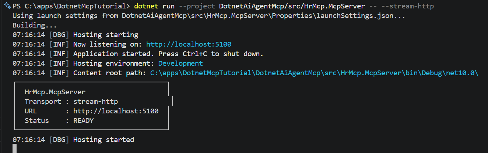
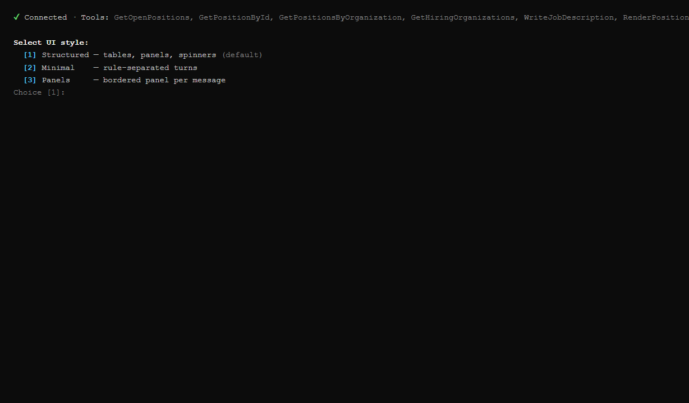
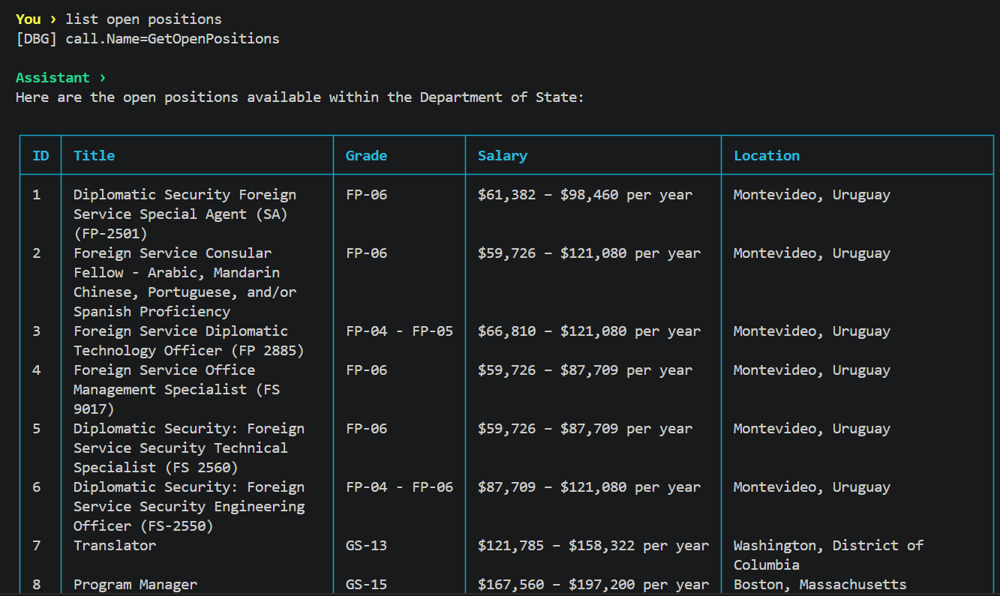

# Part 4: Multi-Model AI Agent with Microsoft.Extensions.AI

**Series:** AI Agents & MCP with .NET 10 | **Part 4 of 6**  
**GitHub:** [workcontrolgit/DotnetAiAgentMcp](https://github.com/workcontrolgit/DotnetAiAgentMcp)

---

## Introduction

In Part 3 we built an MCP server with four tools and verified them with MCP Inspector. The tools work — but no AI is involved yet. That changes now.

In this part we wire up the `HrMcp.Agent` console app: it connects to the MCP server over HTTP, hands the tools to an `IChatClient`, and holds a live conversation where the AI decides which tools to call and when. The agent supports multiple LLM providers — Ollama with gemma4 as the local default, and Azure OpenAI as a production swap-in — all controlled by a single config key. We also add Export Tools that let the AI write positions and job description drafts to Word and Excel files, saved directly to your machine.

By the end you will have a running AI agent that answers HR questions, writes job descriptions, and exports files — no hard-coded logic, no manual tool routing.

---

## The Architecture


`Microsoft.Extensions.AI` is the abstraction layer. `HrAgent.cs` depends only on `IChatClient` — it has no knowledge of whether Ollama or Azure OpenAI is underneath. Provider selection happens in `Program.cs` via a `CreateChatClient()` helper that reads `AI:Provider` from config.

`McpClientTool` bridges the two worlds: it is an `AIFunction` (a `Microsoft.Extensions.AI` type) that dispatches calls to the MCP server over the wire. The chat client's function-invocation middleware handles the loop — call tool, send result back to model, repeat until the model stops calling tools.

---

## Prerequisites

**Option A — Ollama (local, default)**

Run the agent locally for free with no cloud account required:

- **Install Ollama** — download from [ollama.com](https://ollama.com) and install
- **Pull the model** — `ollama pull gemma4`
- **Verify** — `ollama run gemma4 "Say hello"` (should print a greeting)
- **Confirm the API is up** — `curl http://localhost:11434/api/tags` (lists pulled models)

Ollama runs a local HTTP server on port `11434`. Nothing leaves your machine.

**Option B — Azure OpenAI**

Set `AI:Provider` to `AzureOpenAI` in `appsettings.json` and fill in your endpoint, deployment name, and API key. See the [Multi-Model Configuration](#multi-model-configuration) section below for details. `HrAgent.cs` is unchanged — only `Program.cs` and config differ.

---

## Step 1 — Packages

### `HrMcp.Agent`

```bash
dotnet add src/HrMcp.Agent package Microsoft.Extensions.AI --version 9.*
dotnet add src/HrMcp.Agent package OllamaSharp --version 5.*
dotnet add src/HrMcp.Agent package Azure.AI.OpenAI --version 2.*
dotnet add src/HrMcp.Agent package ModelContextProtocol --version 1.*
```

The agent is a pure MCP client — it has no direct database access.

Why four packages:

- **`Microsoft.Extensions.AI`** — `IChatClient`, `ChatMessage`, `ChatOptions`, `AITool` abstractions
- **`OllamaSharp`** — `OllamaApiClient`, the Ollama provider; implements `IChatClient` natively. Use for local development with gemma4.
- **`Azure.AI.OpenAI`** — `AzureOpenAIClient`, for production deployment via Azure. Only active when `AI:Provider = AzureOpenAI` in config.
- **`ModelContextProtocol`** — `McpClient`, `HttpClientTransport`, `McpClientTool`; the client half of the MCP SDK

> **Note:** `Microsoft.Extensions.AI.Ollama` was the early preview provider and is now deprecated in the GA release. The official Microsoft.Extensions.AI GA guidance recommends `OllamaSharp` instead. `OllamaApiClient` (from `OllamaSharp`) implements `IChatClient` directly — no wrapper needed.

The MCP server has no AI dependency. It is a pure data layer — no LLM packages required.

---

## Step 2 — `HrAgent.cs`

Create `src/HrMcp.Agent/HrAgent.cs`. This class owns the conversation loop and keeps message history. It takes `IChatClient` and the list of MCP tools as constructor parameters — both are wired in `Program.cs`.

> **Package dependency:** Add `Spectre.Console 0.49.*` to `HrMcp.Agent.csproj`:
> ```xml
> <PackageReference Include="Spectre.Console" Version="0.49.*" />
> ```

```csharp
// src/HrMcp.Agent/HrAgent.cs
using Microsoft.Extensions.AI;
using Spectre.Console;

namespace HrMcp.Agent;

public enum UiStyle { Structured, Minimal, Panels }

public sealed class HrAgent(IChatClient chatClient, IList<AITool> tools, UiStyle style = UiStyle.Structured)
{
    private const string SystemPrompt = """
        You are an HR assistant for a U.S. federal agency. You help users explore open job
        positions, hiring organizations, and generate job announcements.

        Guidelines:
        - Always call GetHiringOrganizations before GetPositionsByOrganization to get valid IDs.
        - When asked about open positions, use GetOpenPositions first for an overview, then
          GetPositionById for full detail on a specific role.
        - When asked to write or generate a job description, call WriteJobDescription with the
          position ID — do not write one yourself.
        - When asked to display, show, render, or draft a position "in USAJobs format", "as a
          USAJobs page", or "like USAJobs", call RenderPositionAsUsaJobsHtml with the position ID.
          The tool saves the file and returns its path — tell the user the file path and that they
          can open it in a browser to see the USAJobs-style layout.
        - Present pay ranges in a readable format (e.g., "$85,000 – $110,000 per year").
        - Keep answers concise; offer to go deeper when the user wants more detail.
        """;

    private readonly List<ChatMessage> _history =
    [
        new(ChatRole.System, SystemPrompt)
    ];

    public async Task RunAsync(CancellationToken ct = default)
    {
        RenderWelcome();

        while (!ct.IsCancellationRequested)
        {
            var input = RenderUserPrompt();

            if (string.IsNullOrWhiteSpace(input)) continue;
            if (input.Equals("exit", StringComparison.OrdinalIgnoreCase)) break;

            _history.Add(new ChatMessage(ChatRole.User, input));

            ChatResponse response = default!;
            Exception? spinnerException = null;
            AnsiConsole.Status()
                .Spinner(Spinner.Known.Dots)
                .SpinnerStyle(Style.Parse("blue"))
                .Start("[blue]Thinking…[/]", _ =>
                {
                    try
                    {
                        response = chatClient.GetResponseAsync(
                            _history,
                            new ChatOptions { Tools = tools },
                            ct).GetAwaiter().GetResult();
                    }
                    catch (Exception ex) { spinnerException = ex; }
                });
            if (spinnerException is not null)
                System.Runtime.ExceptionServices.ExceptionDispatchInfo.Capture(spinnerException).Throw();

            _history.AddMessages(response);
            RenderResponse(response.Text ?? string.Empty);
        }
    }

    private void RenderWelcome()
    {
        switch (style)
        {
            case UiStyle.Structured:
            default:
                AnsiConsole.Write(new Rule("[bold cyan]HR Assistant[/]").RuleStyle("cyan").LeftJustified());
                AnsiConsole.MarkupLine("[grey]Ask about open positions, organizations, or job descriptions. Type [bold]exit[/] to quit.[/]\n");
                break;
            case UiStyle.Minimal:
                AnsiConsole.MarkupLine("[teal]HR Assistant ready.[/] Ask about open positions, organizations, or job descriptions.");
                AnsiConsole.MarkupLine("[grey]Type [bold]exit[/] to quit.[/]\n");
                break;
            case UiStyle.Panels:
                AnsiConsole.Write(
                    new Panel("[bold]HR Assistant[/]\n[grey]Ask about open positions, organizations, or job descriptions.[/]")
                        .Header("[cyan]🤖 Ready[/]")
                        .BorderColor(Color.Cyan1)
                        .Padding(1, 0));
                AnsiConsole.MarkupLine("[grey]Type [bold]exit[/] to quit.[/]\n");
                break;
        }
    }

    private string RenderUserPrompt()
    {
        switch (style)
        {
            case UiStyle.Structured:
            default:
                AnsiConsole.Markup("[bold yellow]You ›[/] ");
                return Console.ReadLine() ?? string.Empty;
            case UiStyle.Minimal:
                AnsiConsole.Write(new Rule("[bold yellow]You[/]").RuleStyle("grey").LeftJustified());
                return Console.ReadLine() ?? string.Empty;
            case UiStyle.Panels:
                return AnsiConsole.Ask<string>("[bold yellow]You[/]");
        }
    }

    private void RenderResponse(string text)
    {
        switch (style)
        {
            case UiStyle.Structured:
            default:
                AnsiConsole.MarkupLine("\n[bold green]Assistant ›[/]");
                AnsiConsole.Write(new Markup(Markup.Escape(text)));
                AnsiConsole.WriteLine();
                AnsiConsole.Write(new Rule().RuleStyle("grey"));
                AnsiConsole.WriteLine();
                break;
            case UiStyle.Minimal:
                AnsiConsole.Write(new Rule("[bold green]Assistant[/]").RuleStyle("grey").LeftJustified());
                AnsiConsole.Write(
                    new Panel(new Markup(Markup.Escape(text)))
                        .BorderColor(Color.Teal)
                        .Padding(1, 0));
                AnsiConsole.WriteLine();
                break;
            case UiStyle.Panels:
                AnsiConsole.Write(
                    new Panel(new Markup(Markup.Escape(text)))
                        .Header("[bold green]ASSISTANT[/]")
                        .BorderColor(Color.Aquamarine3)
                        .Padding(1, 0));
                AnsiConsole.WriteLine();
                break;
        }
    }
}
```

Design notes:

- **`IList<AITool> tools`** — typed as `AITool` (the M.E.AI abstraction), not `McpClientTool`. `HrAgent` doesn't know or care that the tools come from MCP.
- **`_history.AddMessages(response)`** — adds all messages from the response (including any tool-call/tool-result messages the middleware appended) back into history for the next turn.
- **`GetResponseAsync`** — the `IChatClient` interface method in `Microsoft.Extensions.AI` 9.x. Returns `ChatResponse`; `.Text` is the assistant's final text.
- **`UseFunctionInvocation` middleware** (set up in `Program.cs`) intercepts tool-call messages, dispatches them to the MCP server, injects the results, and loops until the model produces a text response — all transparently.

---

## Step 3 — `Program.cs` for `HrMcp.Agent`

`Program.cs` wires together three concerns: transport (how to reach the MCP server), LLM provider (which model to use), and the agent itself.

```csharp
// src/HrMcp.Agent/Program.cs (simplified — see GitHub for full version with OIDC + stdio transport)
using Azure.AI.OpenAI;
using Azure.Identity;
using HrMcp.Agent;
using Microsoft.Extensions.AI;
using Microsoft.Extensions.Configuration;
using ModelContextProtocol.Client;
using OllamaSharp;
using Spectre.Console;

var configuration = new ConfigurationBuilder()
    .SetBasePath(AppContext.BaseDirectory)
    .AddJsonFile("appsettings.json", optional: false)
    .AddUserSecrets<Program>(optional: true)
    .AddEnvironmentVariables()
    .Build();

// Connect to the MCP server over HTTP (must be running on http://localhost:5100)
await using var mcpClient = await McpClient.CreateAsync(
    new HttpClientTransport(new HttpClientTransportOptions
    {
        Endpoint = new Uri(configuration["McpServer:Transport:StreamHttp:Url"] ?? "http://localhost:5100/mcp"),
        TransportMode = HttpTransportMode.StreamableHttp,
        Name = "hr-mcp-stream-http"
    }));

var mcpTools = await mcpClient.ListToolsAsync();

// Style picker — 2-second auto-select, defaults to Structured
var style = UiStyle.Structured;
// ... (see GitHub for full picker code)

IChatClient chatClient = CreateChatClient(configuration);

var numCtx = configuration.GetValue<int?>("AI:Ollama:NumCtx");
var outputFolder = FindOutputFolder();
var agent = new HrAgent(chatClient, mcpTools.Cast<AITool>().ToList(), style, numCtx, outputFolder);
await agent.RunAsync();

static IChatClient CreateChatClient(IConfiguration configuration)
{
    var provider = configuration["AI:Provider"] ?? "Ollama";

    if (string.Equals(provider, "Ollama", StringComparison.OrdinalIgnoreCase))
    {
        var endpoint = configuration["AI:Ollama:Endpoint"] ?? "http://localhost:11434";
        var model = configuration["AI:Ollama:Model"] ?? "gemma4:latest";
        var httpClient = new HttpClient { BaseAddress = new Uri(endpoint), Timeout = Timeout.InfiniteTimeSpan };
        return (IChatClient)new OllamaApiClient(httpClient, model, null!);
    }

    // Azure OpenAI
    var azureEndpoint = configuration["AI:AzureOpenAI:Endpoint"]!;
    var azureDeployment = configuration["AI:AzureOpenAI:Deployment"]!;
    var apiKey = configuration["AI:AzureOpenAI:ApiKey"];

    var client = string.IsNullOrWhiteSpace(apiKey)
        ? new AzureOpenAIClient(new Uri(azureEndpoint), new DefaultAzureCredential())
        : new AzureOpenAIClient(new Uri(azureEndpoint), new System.ClientModel.ApiKeyCredential(apiKey));

    return client.GetChatClient(azureDeployment).AsIChatClient();
}

static string FindOutputFolder()
{
    var dir = new DirectoryInfo(AppContext.BaseDirectory);
    for (var i = 0; i < 8 && dir is not null; i++, dir = dir.Parent)
    {
        if (Directory.Exists(Path.Combine(dir.FullName, "usajobs")))
            return Path.Combine(dir.FullName, "usajobs", "output");
    }
    return Path.GetFullPath("usajobs/output");
}
```

### Multi-Model Configuration

Provider selection is driven by `appsettings.json` — no code changes required to switch models:

```json
{
  "AI": {
    "Provider": "Ollama",
    "Ollama": {
      "Endpoint": "http://localhost:11434",
      "Model": "gemma4:latest",
      "NumCtx": 32768
    },
    "AzureOpenAI": {
      "Endpoint": "https://YOUR-RESOURCE-NAME.openai.azure.com/",
      "Deployment": "gpt-4.1-mini",
      "ApiKey": "YOUR_AZURE_OPENAI_KEY"
    }
  }
}
```

Set `AI:Provider` to `"AzureOpenAI"` to switch providers. For production, store `ApiKey` in user secrets or an environment variable — never in committed config.

### What each piece does

- **`McpClient.CreateAsync`** — creates an MCP client connected to the running server. `StreamableHttp` is the modern transport mode (replaces SSE from earlier SDK versions).
- **`mcpClient.ListToolsAsync()`** — fetches the tool list from the server. Returns `IList<McpClientTool>`. Each `McpClientTool` is an `AIFunction` (which is an `AITool`) — the bridge between the MCP protocol and `Microsoft.Extensions.AI`.
- **`CreateChatClient()`** — branches on `AI:Provider`. Returns `OllamaApiClient` for local dev or `AzureOpenAIClient` for cloud. Either way the return type is `IChatClient` — `HrAgent` never sees the difference.
- **`FindOutputFolder()`** — walks up from the binary's directory to find the `usajobs/` folder, then returns `usajobs/output/` as the save target for exported files.
- **`numCtx`** — Ollama context window size, passed to `HrAgent` as an `AdditionalProperties` hint. Ignored when using Azure OpenAI.

---

## Step 4 — Build

```bash
dotnet build DotnetAiAgentMcp.slnx   # 0 errors, 0 warnings
```

---

## Step 5 — Run a Conversation

Start the MCP server in one terminal:

```bash
dotnet run --project src/HrMcp.McpServer
```

In a second terminal, start the agent:

```bash
dotnet run --project src/HrMcp.Agent
```

You should see the MCP server log in the first terminal:



And in the agent terminal — a style picker with a 2-second auto-select defaulting to **Structured**:



### Sample conversation

The agent uses colored labels, a spinner while calling MCP tools, and a horizontal rule after each response:



---

## Job Descriptions — the LLM Writes Them

Earlier versions of this series included a `WriteJobDescription` MCP tool that called Ollama server-side to generate a narrative. That tool has been removed. Here is why — and what replaced it.

**The old approach:** `JobDescriptionTools.cs` on the McpServer injected `IChatClient` and called the LLM inside the tool. The agent saw it as a black box: call tool, get text back.

**The problem:** It coupled the MCP server to a specific LLM provider and required Ollama to be reachable from the server process — even when running in Claude Desktop or a cloud deployment where only the agent has LLM access. It also meant the job description was written without conversational context (no history, no user feedback loop).

**The new approach:** The agent's system prompt instructs the model to call `GetPositionById` first, then write the job announcement itself:

```
- When asked to write a job description, call GetPositionById to get the full position
  data, then write a compelling USAJobs-style job announcement yourself with these sections:
  ## Summary, ## Duties, ## Qualifications Required, ## How to Apply.
  Use professional federal HR writing style. Be specific and engaging.
```

No extra code. No extra tool. The LLM already has the full position data from the tool call and writes the narrative in the same turn. The user can then ask for edits ("make the qualifications section stronger"), and the model refines it — something the server-side tool could never do.

The MCP server is now a **pure data layer**: it exposes data and export tools, and has no LLM dependency at all.

---

## What Happened Under the Hood

For the question "Show me IT positions at USCIS", the model made two tool calls before answering:

1. **`GetHiringOrganizations`** — to find the USCIS organization ID (following the system prompt guideline)
2. **`GetPositionsByOrganization(organizationId: 1)`** — to retrieve USCIS-specific positions

The `UseFunctionInvocation` middleware handled both dispatches automatically. Your code in
`HrAgent.cs` called `GetResponseAsync` once and got back the final answer — the middleware
looped through tool calls transparently.

---

## What Changed in the SDK (M.E.AI 9.x)

If you have seen older `Microsoft.Extensions.AI` examples, two things changed in 9.x:

- **`CompleteAsync` → `GetResponseAsync`** — the method on `IChatClient` was renamed
- **`ChatCompletion` → `ChatResponse`** — the return type was renamed; use `.Text` for the assistant's text
- **`McpClientFactory` + `SseClientTransport` → `McpClient.CreateAsync` + `HttpClientTransport`** — the MCP client API was updated in `ModelContextProtocol.Core` 1.x

The underlying concepts are identical — the renames are surfaced here so you know why the older patterns no longer compile.

---

## Swapping Providers

`HrAgent.cs` depends only on `IChatClient`. To switch from Ollama to another provider, change
three lines in `Program.cs` — nothing else:

**Azure OpenAI:**
```csharp
IChatClient chatClient = new AzureOpenAIClient(
        new Uri("https://YOUR-RESOURCE.openai.azure.com"),
        new AzureKeyCredential(Environment.GetEnvironmentVariable("AZURE_OPENAI_KEY")!))
    .AsChatClient("gpt-4o")
    .AsBuilder()
    .UseFunctionInvocation()
    .Build();
```

**OpenAI:**
```csharp
IChatClient chatClient = new OpenAIClient(
        new ApiKeyCredential(Environment.GetEnvironmentVariable("OPENAI_KEY")!))
    .AsChatClient("gpt-4o-mini")
    .AsBuilder()
    .UseFunctionInvocation()
    .Build();
```

The required packages (`Microsoft.Extensions.AI.AzureAIInference` or `Microsoft.Extensions.AI.OpenAI`)
are the only addition. `HrAgent`, `HrMcp.McpServer`, and all tool classes are untouched.

---

## What We Built

- **`HrMcp.Agent`** — console AI agent using `IChatClient` + MCP tools
- **`HrAgent.cs`** — conversation loop with system prompt and full history management
- **`McpClient` + `HttpClientTransport`** — MCP client connected to the running server
- **`UseFunctionInvocation` middleware** — automatic tool dispatch, no manual routing
- **Build** — 0 errors, 0 warnings

---

## Next Up

**[Part 5: Claude Desktop Integration & End-to-End Demo →](part-5-claude-desktop-integration.md)**

We publish the MCP server as a self-contained executable, add it to `claude_desktop_config.json`,
and verify the full end-to-end flow from Claude Desktop — the same tools, now callable from a
professional AI host with no agent code required.

---

## Sources

- [Microsoft.Extensions.AI — NuGet](https://www.nuget.org/packages/Microsoft.Extensions.AI)
- [OllamaSharp — NuGet](https://www.nuget.org/packages/OllamaSharp)
- [ModelContextProtocol — NuGet](https://www.nuget.org/packages/ModelContextProtocol)
- [ModelContextProtocol C# SDK — GitHub](https://github.com/modelcontextprotocol/csharp-sdk)
- [Ollama — Download](https://ollama.com)
- [Microsoft.Extensions.AI — Announcement Blog](https://devblogs.microsoft.com/dotnet/introducing-microsoft-extensions-ai-preview/)
