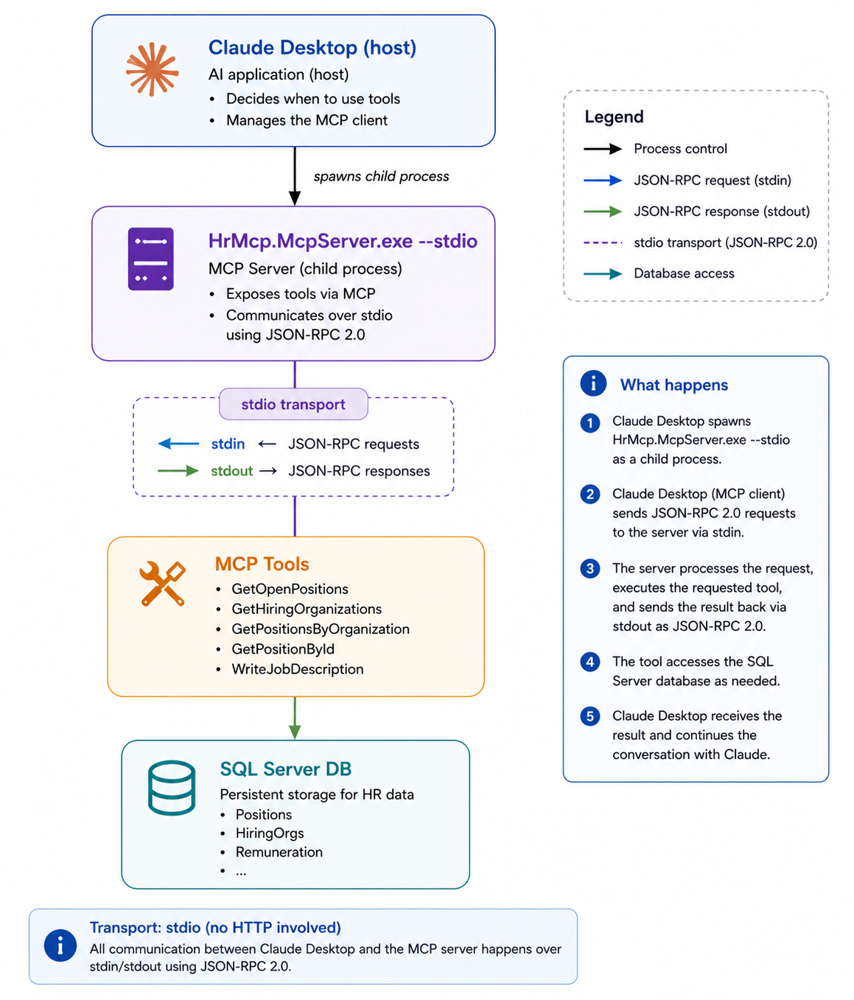

# Part 5: Claude Desktop Integration & End-to-End Demo

**Series:** [AI Agents & MCP with .NET 10](preface.md) | **Part 5 of 6**  
**GitHub:** [workcontrolgit/DotnetAiAgentMcp](https://github.com/workcontrolgit/DotnetAiAgentMcp)


---

## Introduction

In Part 4 we built `HrMcp.Agent`, a .NET MCP client that can talk to the server over `stdio` or Streamable HTTP. That is one consumption path.

This part shows another path: connect the same server directly to **Claude Desktop** over `stdio`, so Claude can call the MCP tools without any custom agent code.

The important current-code detail is that Claude Desktop should use the server in **`stdio` mode**, not HTTP mode.

By the end of this post you will have:

- a published `HrMcp.McpServer` executable
- a working Claude Desktop MCP entry
- the current 8-tool surface visible in Claude Desktop
- a debugging flow that matches the repo as it exists today

---

## Why Claude Desktop Uses `stdio`

Claude Desktop launches local MCP servers as child processes and communicates over standard input/output.

That means:

- Claude starts the process
- Claude writes MCP messages to stdin
- Claude reads MCP messages from stdout
- stderr is for logs and diagnostics

This is why `stdio` is the right transport for local desktop clients.

It is also why the server must keep stdout clean. Any non-protocol text written to stdout can corrupt the MCP stream.

In the current repo, `HrMcp.McpServer` handles this by:

- switching to `Host.CreateApplicationBuilder(...)` for `stdio`
- registering `.WithStdioServerTransport()`
- writing status output to `Console.Error`
- sending Serilog console output to stderr in `stdio` mode

That is a change from the older blog draft, which described a different logging setup.



---

## Step 1 - Publish the Server

Claude Desktop needs a command it can launch. Publish a self-contained executable:

```bash
dotnet publish DotnetAiAgentMcp/src/HrMcp.McpServer/HrMcp.McpServer.csproj ^
  -c Release ^
  -r win-x64 ^
  --self-contained true ^
  -o publish/McpServer
```

After publishing, you should have:

- `publish/McpServer/HrMcp.McpServer.exe` on Windows
- the supporting files next to it, including config files

On macOS or Linux, use the corresponding runtime identifier instead of `win-x64`.

---

## Step 2 - Configure Claude Desktop

### Windows

Edit:

```text
%APPDATA%\Claude\claude_desktop_config.json
```

### macOS

Edit:

```text
~/Library/Application Support/Claude/claude_desktop_config.json
```

If the file does not exist, create it.

### Example config

```json
{
  "mcpServers": {
    "hr-mcp": {
      "command": "C:\\apps\\DotnetMcpTutorial\\publish\\McpServer\\HrMcp.McpServer.exe",
      "args": ["--stdio"],
      "env": {
        "ASPNETCORE_ENVIRONMENT": "Production"
      }
    }
  }
}
```

Important points:

- pass `--stdio`
- point `command` to the published executable
- use double backslashes on Windows JSON paths

Then fully quit Claude Desktop and relaunch it.

---

## Step 3 - What Tools Should Appear

The current server exposes **8 tools**, not the older 4-tool or 5-tool surface:

**Data tools**

- `GetHiringOrganizations`
- `GetOpenPositions`
- `GetPositionById`
- `GetPositionsByOrganization`

**Export tools**

- `ExportPositionToHtml`
- `ExportPositionToWord`
- `ExportDraftToWord`
- `ExportPositionsToExcel`

These should appear in Claude Desktop’s tools UI once the server loads successfully.

What changed relative to older drafts:

- there is no server-side `WriteJobDescription` tool anymore
- export tools are now part of the MCP surface

The model writes job-description text conversationally after calling `GetPositionById`; the server does not own that LLM step.

---

## Step 4 - Try Real Prompts

Good prompts for the current tool surface:

**Organization discovery**

> What hiring organizations are available?

Expected tool path:

- `GetHiringOrganizations`

**Open positions**

> Show me the open positions.

Expected tool path:

- `GetOpenPositions`

**Scoped lookup**

> Show me positions for organization ID 1.

Expected tool path:

- `GetPositionsByOrganization`

**Full detail**

> Give me full details for position ID 1.

Expected tool path:

- `GetPositionById`

**HTML export**

> Export position 1 as a USAJobs-style HTML page.

Expected tool path:

- `ExportPositionToHtml`

**Word export**

> Export position 1 to Word.

Expected tool path:

- `ExportPositionToWord`

Because Claude Desktop is not our custom .NET agent, the export-file experience depends on the host. The MCP server still returns the correct `{ fileName, content }` payload, but Claude Desktop may present or summarize that payload differently than `HrMcp.Agent`, which explicitly intercepts and saves files locally.

---

## Optional - VS Code MCP Config

If you also want to point VS Code at the same MCP server, use a workspace-level MCP config such as:

```json
{
  "servers": {
    "hr-mcp": {
      "type": "http",
      "url": "http://localhost:5100/mcp"
    }
  }
}
```

That uses the server’s HTTP path, not `stdio`, so it is a different transport shape from Claude Desktop.

If you later enable OIDC on the HTTP endpoint, that path needs corresponding auth support.

---

## Debugging

### 1. Start with the server itself

First verify the server can start in `stdio` mode:

```bash
dotnet run --project DotnetAiAgentMcp/src/HrMcp.McpServer/HrMcp.McpServer.csproj -- --stdio
```

If it starts cleanly and waits for input, the server-side `stdio` path is at least structurally healthy.

### 2. Use MCP Inspector for logic verification

The best split-brain check is:

- test logic and tool behavior with MCP Inspector over HTTP
- test local-process wiring with Claude Desktop over `stdio`

If Inspector works but Claude Desktop does not, the likely problem is:

- bad executable path
- bad JSON config
- Claude not fully restarted
- `stdio` process startup issue

### 3. Common failure cases

**No tools appear**

- wrong `command` path
- invalid JSON in `claude_desktop_config.json`
- Claude Desktop not fully restarted

**Server launches but tool calls fail**

- database migration or seed issue
- server startup exception
- environment/config mismatch

**Protocol corruption**

- something is writing unexpected content to stdout
- `--stdio` was omitted

**Export tools return payloads but not files**

- expected on non-agent hosts unless that host explicitly saves the returned file content
- the server contract is still correct if it returns `{ fileName, content }`

---

## What This Part Proves

This part proves that the MCP server is genuinely host-independent.

The same server can now be consumed by:

- the custom `.NET` agent from Part 4
- Claude Desktop over `stdio`
- HTTP-based tooling like MCP Inspector

That is the architectural payoff of MCP.

---

## Next Up

**[Part 6: Securing the MCP Server with OIDC ->](part-6-mcp-security-oidc.md)**

So far the local `stdio` path has been the easiest path because it stays on one machine. In Part 6 we secure the HTTP-hosted MCP path with OIDC so remote or hosted deployments can require bearer tokens.

---

## Sources

- [Model Context Protocol - Official Docs](https://modelcontextprotocol.io)
- [ModelContextProtocol C# SDK - GitHub](https://github.com/modelcontextprotocol/csharp-sdk)
- [Claude Desktop](https://claude.ai/download)
- [dotnet publish](https://learn.microsoft.com/en-us/dotnet/core/tools/dotnet-publish)
