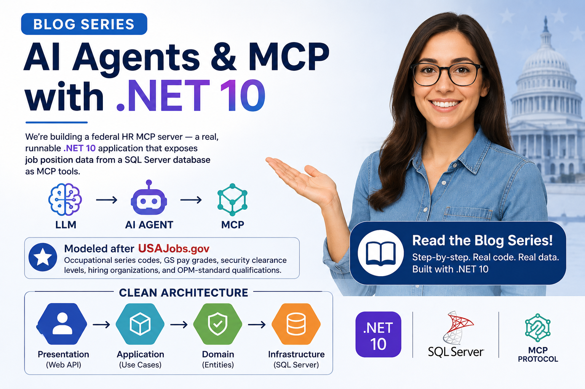
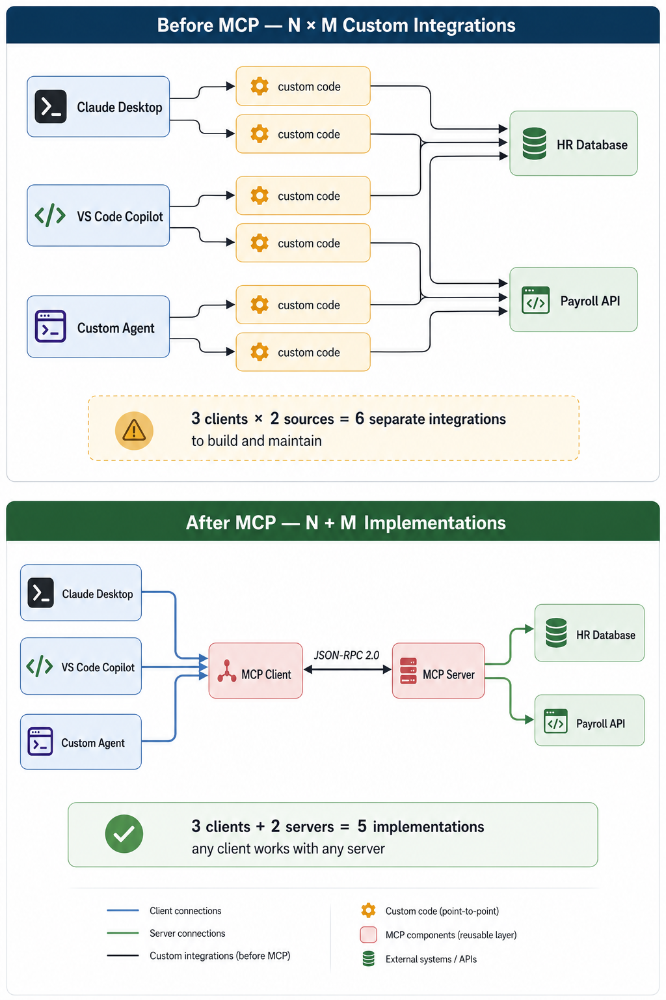
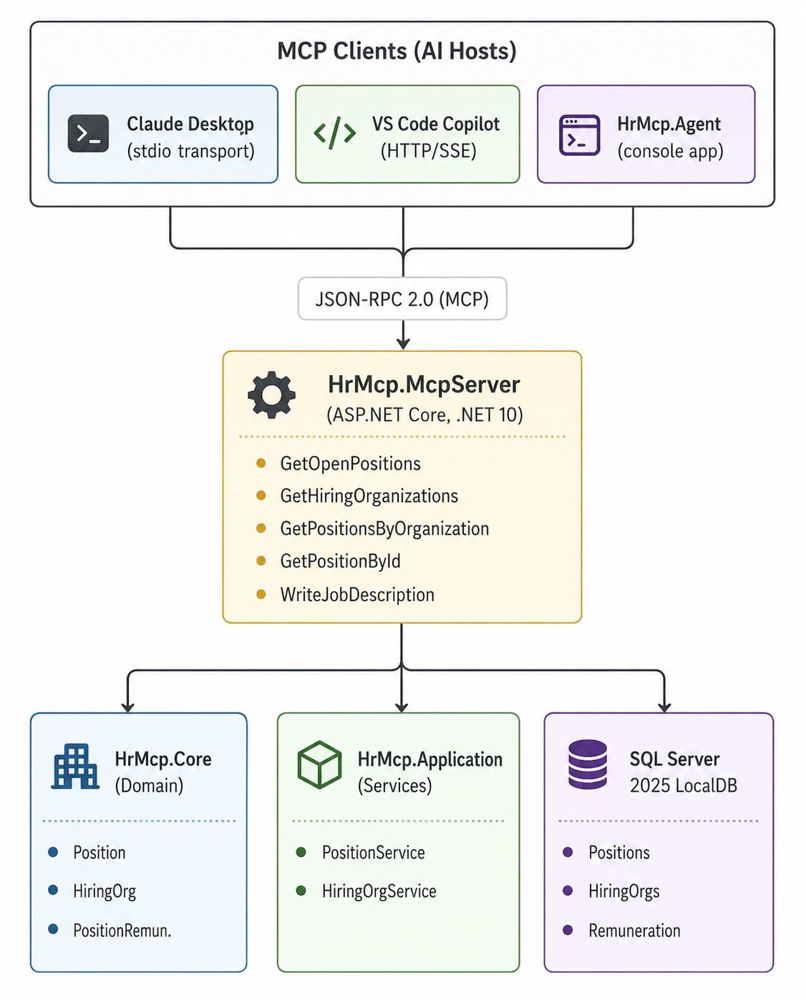

# AI Agents & MCP with .NET 10 — Blog Series

**Series:** AI Agents & MCP with .NET 10  
**GitHub:** [workcontrolgit/DotnetAiAgentMcp](https://github.com/workcontrolgit/DotnetAiAgentMcp)

---

## Your .NET Skills Are Your AI Superpower

You already know C#. You already know dependency injection, EF Core, ASP.NET Core, and Clean Architecture. You know how to build APIs that are fast, maintainable, and production-ready.

That foundation is exactly what AI integration requires — and most tutorials skip over it entirely.

This series is different. We start where you are: a .NET developer with solid backend skills but little exposure to AI agents or the Model Context Protocol. By the end, you will have built a fully working AI-enabled backend from scratch — every line of code explained, every design decision justified, every tool tested.

No Python. No black boxes. No hand-waving.

---

## The Shift Happening Right Now

AI assistants are moving from chat windows into professional workflows. Tools like Claude Desktop, VS Code Copilot, and custom enterprise agents are being asked to do real work: query databases, generate documents, apply business rules, call APIs.

For that to happen, AI needs a way to reach your application's data and logic. The old approach was to build a custom integration for each AI tool and each data source. That approach does not scale.

**Model Context Protocol (MCP)** is the standard that replaces it.

MCP is to AI integration what REST was to web APIs in 2005: a shared contract that lets both sides evolve independently. Learning it now puts you ahead of the transition, not behind it.

---

## What You Will Build

This series builds a federal HR MCP server — a real, runnable .NET 10 application that exposes job position data from a SQL Server database as MCP tools. The domain is modeled after **USAJobs.gov**, the official US federal government job board, which gives us a rich, structured data model to work with: occupational series codes, GS pay grades, security clearance levels, hiring organizations, and OPM-standard qualifications text.

The final system looks like this:

The five-project Clean Architecture solution:

- **HrMcp.Core** — domain entities and repository interfaces. No dependencies.
- **HrMcp.Application** — application services. Depends only on Core.
- **HrMcp.Infrastructure.Persistence** — EF Core + SQL Server. Implements Core interfaces.
- **HrMcp.McpServer** — ASP.NET Core MCP server. Exposes tools to AI clients.
- **HrMcp.Agent** — console AI agent. Connects to the MCP server over `stdio` or Streamable HTTP and uses Ollama or Azure OpenAI through `IChatClient`.

---

## What You Will Learn

This is not a survey course. Every skill is exercised through working code you write yourself.

**Clean Architecture for AI backends**
How to structure a .NET solution so that domain logic is independent of both database infrastructure and AI infrastructure. Swap Ollama for Claude API without touching a single service class.

**Model Context Protocol from first principles**
What MCP is, how JSON-RPC 2.0 messages flow between client and server, and how `stdio` and Streamable HTTP transports differ. You will understand the protocol, not just the SDK.

**Building MCP tools in .NET**
How to use the `ModelContextProtocol.AspNetCore` NuGet package to turn C# methods into AI-callable tools with `[McpServerTool]` and `[McpServerToolType]`. How to write `[Description]` text that gives the AI the context it needs to call tools correctly.

**Microsoft.Extensions.AI — the AI abstraction layer**
How `IChatClient` lets you write model-agnostic agent code. How the agent's manual tool loop routes MCP tool calls. How to swap providers with a config change.

**Local AI with Ollama**
How to run Ollama locally, connect it to an MCP server, and use it as one backing model option for the agent — with zero data leaving your environment.

**Claude Desktop and VS Code Copilot integration**
How to configure two MCP clients to connect to the same server. How stdio transport works under the hood. How to debug the JSON-RPC stream when things go wrong.

**OIDC security for MCP servers**
How to add JWT Bearer authentication to the MCP server using standard ASP.NET Core middleware. How the agent acquires a token via the OAuth2 client credentials flow. How to swap Duende IdentityServer for Okta or Azure Entra ID with two config values.

---

## How This Applies to Your Existing Apps

The skills in this series transfer directly to production scenarios. Here is the bridge from each skill to real-world modernization:

**You have a .NET API with business logic.**
The same pattern — `[McpServerTool]` over an application service — works for any existing API. You are not rewriting your application; you are adding an MCP surface on top of what already exists.

**You have an ASP.NET Core web app.**
The Streamable HTTP transport in Part 3 means your existing web host can become an MCP server with one `builder.Services.AddMcpServer()` call and a route mapping. No new project required.

**You have a SQL Server database.**
EF Core is the bridge. Your existing DbContext and repositories become the data layer behind MCP tools. The AI never touches the database directly — it calls tools, tools call services, services call repositories.

**You use Azure AD / Entra ID for auth.**
Part 6 shows exactly how to validate JWTs from any OIDC provider using four lines of ASP.NET Core middleware. If your existing APIs already use Bearer tokens, the MCP server follows the same pattern.

**You want to give Claude Desktop or VS Code Copilot access to your systems.**
Parts 5 and 3 cover exactly this: publish the server, configure the client, verify the tools load. The same pattern works for any internal tool you want to expose to AI assistants.

---

## The Series at a Glance

**Part 1 — Clean Architecture Foundation with HR Domain**
Build the .NET 10 solution skeleton and the federal HR domain. Entities aligned to the USAJobs API schema. EF Core migrations and realistic seed data. The foundation every other part builds on.
→ *[Read Part 1](part-1-clean-architecture-hr-domain.md)*

---

**Part 2 — Introduction to Model Context Protocol**
No code — pure concepts. The N×M integration problem MCP solves. The three MCP primitives (Tools, Resources, Prompts). How `stdio` and Streamable HTTP transports work. The .NET SDK overview. Read this before writing any MCP code.
→ *[Read Part 2](part-2-intro-to-mcp.md)*

---

**Part 3 — Building an MCP Server in .NET 10**
Install `ModelContextProtocol.AspNetCore`. Register three tool classes and expose the current 8-tool MCP surface. Configure both transports in `Program.cs`. Test with MCP Inspector — no AI host needed.
→ *[Read Part 3](part-3-mcp-server-dotnet.md)*

---

**Part 4 — AI Agent with Microsoft.Extensions.AI + Ollama**
Set up Ollama locally. Connect the `HrMcp.Agent` console app to the MCP server over `stdio` by default or Streamable HTTP when needed. Use the current manual tool loop to call your MCP tools and answer HR questions in natural language.
→ *[Read Part 4](part-4-ai-agent-extensions-ai.md)*

---

**Part 5 — Claude Desktop Integration & End-to-End Demo**
Publish the server as a self-contained executable. Configure Claude Desktop to launch it via `stdio`. Optionally point other tools at the HTTP route. Debug the protocol stream. Walk through a live HR session calling the current 8-tool MCP surface.
→ *[Read Part 5](part-5-claude-desktop-integration.md)*

---

**Part 6 — Securing the MCP Server with OIDC**
Add JWT Bearer authentication using four lines of ASP.NET Core middleware. Configure Duende IdentityServer in Docker as the OIDC provider. Implement the OAuth2 client credentials flow in the agent. Swap to Okta or Azure Entra ID with two config values.
→ *[Read Part 6](part-6-mcp-security-oidc.md)*

---

## Prerequisites

You will get the most from this series if you are comfortable with:

- **C# and .NET** — classes, interfaces, async/await, dependency injection
- **ASP.NET Core** — middleware, `WebApplication.CreateBuilder`, configuration
- **EF Core basics** — `DbContext`, migrations, LINQ queries

You do not need prior experience with AI, LLMs, MCP, or OAuth2. Each concept is introduced from scratch.

**Tools you will need:**

- **.NET 10 SDK** — `dotnet --version` should show 10.x or later
- **SQL Server 2025 LocalDB** — ships with Visual Studio 2022/2026; install standalone from Microsoft if needed
- **Ollama** — free local LLM runtime; download from [ollama.com](https://ollama.com)
- **Claude Desktop** — free download from [claude.ai](https://claude.ai) (optional — only needed for Part 5)
- **Git** — for cloning the companion repository

---

## The Companion Repository

Every code listing in this series is in the companion GitHub repository. You can clone it and follow along, or read the posts and build from scratch — both paths arrive at the same working application.

→ **[github.com/workcontrolgit/DotnetAiAgentMcp](https://github.com/workcontrolgit/DotnetAiAgentMcp)**

---

## Supplement Blogs

Standalone guides that go deeper on specific topics from this series:

- [Why Ollama Goes Silent on Large Inputs — and How to Fix It in .NET](https://medium.com/scrum-and-coke/why-ollama-goes-silent-on-large-inputs-and-how-to-fix-it-in-net-97d3dd7ec860)
- [From Ollama to Azure Foundry: LLM Setup for .NET MCP](https://medium.com/scrum-and-coke/from-ollama-to-azure-foundry-llm-setup-for-net-mcp-6e7a2e06f64f)
- [Magnificent 7 Tools Every .NET MCP Developer Should Know](../standalone/7-mcp-tools-dotnet.md)

---

*Ready? Start with Part 1 and build the foundation.*

→ **[Part 1: Clean Architecture Foundation with HR Domain](part-1-clean-architecture-hr-domain.md)**
