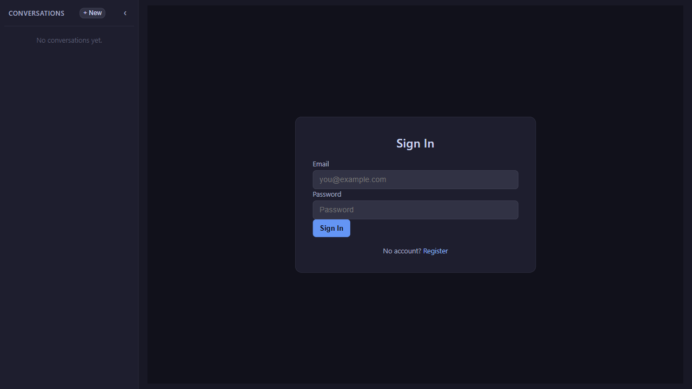
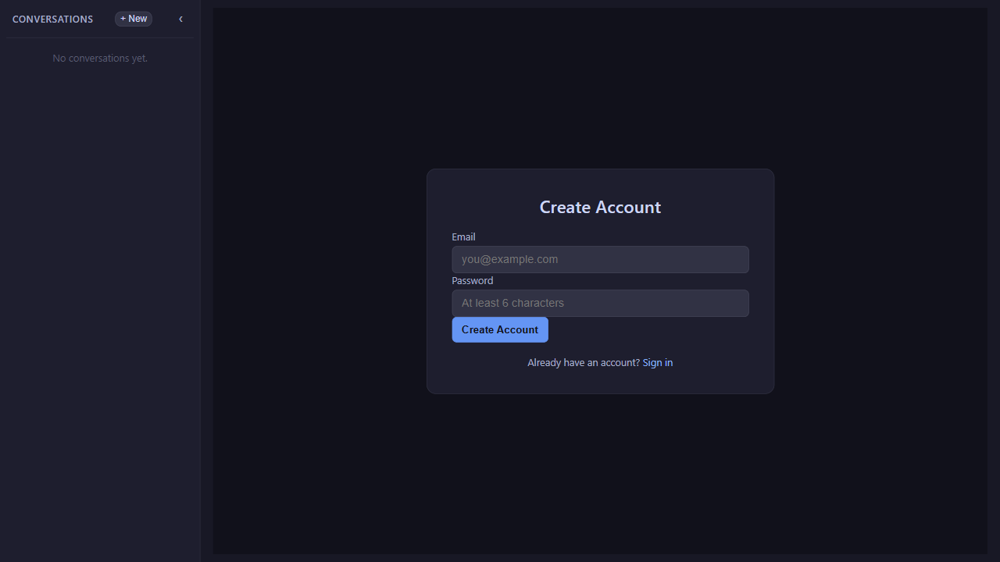

# Part 6: Securing the UI with OIDC

Series: AI Agent UI with Blazor United & .NET 10 | Part 6 of 8
GitHub: workcontrolgit/DotnetAiAgentUiTutorial


---

## Introduction

Five parts in, the Writing Assistant does real work: the agent drafts content, streams responses token by token, renders markdown, lets you edit in a WYSIWYG panel, and exports to Word. The UI works. Now lock it down.

This is the Series 2 parallel to **Series 1 Part 6**, which secured the MCP server with OIDC-backed JWT bearer authentication. The symmetry is intentional but the concerns are different. Series 1 protected the *server* — it made the HTTP MCP route require a valid bearer token before any tool call could run. This part protects the *client* — it makes the Blazor UI acquire that bearer token on behalf of the user and pass it through to the MCP transport, while also restricting which users can open the workspace at all.

Put another way: Series 1 Part 6 locked the back door. This part locks the front.

The mechanism is OAuth 2.0 **client credentials flow**: the Blazor app acts as an OAuth2 confidential client, authenticates against an identity provider (Duende IdentityServer in development; Okta or Azure Entra ID in staging/production), receives an access token, and attaches `Authorization: Bearer <token>` to every outbound HTTP MCP request. This works regardless of which provider you use because the only things that change are two configuration values.

---

## The OIDC Feature Flag

I do not want to require a running identity provider just to iterate on the UI locally. That friction kills development velocity. So the entire OIDC path is gated behind a single feature flag:

```json
// DotnetAiAgentUI/src/HrMcp.Agent/appsettings.json
{
  "Features": {
    "EnableOidc": false,
    "EnableDebug": false
  },
  "Oidc": {
    "Authority": "https://localhost:44310",
    "ClientId": "hr-mcp-agent",
    "ClientSecret": "hr-mcp-agent-secret",
    "Scope": "hr-mcp-api"
  }
}
```

When `Features:EnableOidc` is `false` (the default), the app skips token acquisition entirely and the MCP transport carries no `Authorization` header. When you flip it to `true`, the full client credentials flow activates.

This means your local development loop stays fast — no Docker, no identity provider, no token expiry surprises — and you turn on auth exactly once when you're ready to test against a real environment.

---

## Step 1 — Token Acquisition in AgentDraftService

The token acquisition lives in `TryGetOidcHeadersAsync` inside `AgentDraftService`. This is a private static method — it has no instance state dependency — and it returns a `Dictionary<string, string>` that flows directly into the MCP HTTP transport's `AdditionalHeaders`.

```csharp
// DotnetAiAgentUI/src/HrMcp.Agent/Web/Services/AgentDraftService.cs
private static async Task<Dictionary<string, string>> TryGetOidcHeadersAsync(
    IConfiguration configuration,
    CancellationToken ct)
{
    var enableOidc = bool.TryParse(configuration["Features:EnableOidc"], out var oidcFlag) && oidcFlag;
    if (!enableOidc)
        return [];

    var authority = configuration["Oidc:Authority"]
        ?? throw new InvalidOperationException("Missing configuration: Oidc:Authority");
    var clientId = configuration["Oidc:ClientId"]
        ?? throw new InvalidOperationException("Missing configuration: Oidc:ClientId");
    var clientSecret = configuration["Oidc:ClientSecret"]
        ?? throw new InvalidOperationException("Missing configuration: Oidc:ClientSecret");
    var scope = configuration["Oidc:Scope"]
        ?? throw new InvalidOperationException("Missing configuration: Oidc:Scope");

    using var tokenHandler = new HttpClientHandler
    {
        ServerCertificateCustomValidationCallback =
            HttpClientHandler.DangerousAcceptAnyServerCertificateValidator
    };
    using var tokenClient = new HttpClient(tokenHandler);

    var tokenResponse = await tokenClient.PostAsync(
        $"{authority.TrimEnd('/')}/connect/token",
        new FormUrlEncodedContent(new Dictionary<string, string>
        {
            ["grant_type"] = "client_credentials",
            ["client_id"] = clientId,
            ["client_secret"] = clientSecret,
            ["scope"] = scope,
        }),
        ct);
    tokenResponse.EnsureSuccessStatusCode();

    var tokenDoc = await tokenResponse.Content.ReadFromJsonAsync<System.Text.Json.JsonElement>(ct);
    var accessToken = tokenDoc.GetProperty("access_token").GetString()!;

    return new Dictionary<string, string>
    {
        ["Authorization"] = $"Bearer {accessToken}"
    };
}
```

A few things worth noting:

**The `DangerousAcceptAnyServerCertificateValidator` is intentional for development.** Duende IdentityServer running locally on `https://localhost:44310` uses a self-signed dev certificate. In production, remove this handler and let the default TLS validation run.

**The method fails loudly.** If `Features:EnableOidc` is `true` but `Oidc:Authority` is missing, it throws rather than silently continuing without auth. This is the right call — you want to know immediately if the config is incomplete.

**The returned dictionary flows directly into the transport.** In `EnsureInitializedAsync`, the call chain is:

```csharp
var additionalHeaders = await TryGetOidcHeadersAsync(_configuration, ct);
var clientTransport = await CreateClientTransportAsync(_configuration, transportType, additionalHeaders);
```

And inside `CreateClientTransportAsync` for the HTTP path:

```csharp
return new HttpClientTransport(new HttpClientTransportOptions
{
    Endpoint = new Uri(mcpServerUrl),
    AdditionalHeaders = additionalHeaders,   // Bearer token lands here
    TransportMode = HttpTransportMode.StreamableHttp,
    Name = "hr-mcp-stream-http"
}, httpClient, null, ownsHttpClient: true);
```

The `stdio` transport ignores `additionalHeaders` entirely. So `stdio` users are unaffected by this change, exactly as in Series 1 — the OIDC concern is scoped to the HTTP boundary.

---

## Step 2 — Blazor Auth State and AuthorizeView

Token acquisition handles the outbound MCP call. The inbound question — who is allowed to open the Writing Assistant at all — is answered by Blazor's `AuthorizeView` component.

First, add the authorization services. In `RunWebAsync` inside `Program.cs`, add:

```csharp
// DotnetAiAgentUI/src/HrMcp.Agent/Program.cs
static async Task RunWebAsync(string[] args)
{
    var builder = WebApplication.CreateBuilder(args);
    builder.WebHost.UseStaticWebAssets();

    builder.Services.AddRazorComponents()
        .AddInteractiveServerComponents();

    // Add Blazor auth state support
    builder.Services.AddCascadingAuthenticationState();
    builder.Services.AddScoped<IAgentDraftService, AgentDraftService>();

    var app = builder.Build();
    app.UseStaticFiles();
    app.MapStaticAssets();
    app.UseAntiforgery();

    // Enable auth middleware when OIDC is on
    var enableOidc = app.Configuration.GetValue<bool>("Features:EnableOidc");
    if (enableOidc)
    {
        app.UseAuthentication();
        app.UseAuthorization();
    }

    app.MapRazorComponents<App>()
        .AddInteractiveServerRenderMode();

    Console.WriteLine("HrMcp.Agent starting in web mode. Pass --console to run the console agent instead.");
    await app.RunAsync();
}
```

Then protect the workspace page with the `[Authorize]` attribute. Unauthorized users are redirected to `/login` automatically via `ConfigureApplicationCookie`:

```razor
@* DotnetAiAgentUI/src/HrMcp.Agent/Components/Pages/DraftWorkspace.razor *@
@page "/"
@page "/workspace/{SessionId:guid}"
@rendermode @(new InteractiveServerRenderMode(prerender: false))
@attribute [Authorize]
```

And register the cookie login path in `Program.cs`:

```csharp
builder.Services.ConfigureApplicationCookie(options =>
{
    options.LoginPath = "/login";
    options.LogoutPath = "/logout";
});
```

Any unauthenticated request to `/` or `/workspace/{id}` is redirected to `/login` by the cookie middleware — no manual `AuthorizeView` wrapper needed.



**A note on Blazor Server vs. Blazor WASM auth.** In Blazor WebAssembly, the authentication state is client-side — the token lives in the browser, and `AuthorizeView` checks it locally. In Blazor Server (which is what this project uses via Interactive Server render mode), the auth state is managed server-side over the SignalR connection. The `AuthenticationStateProvider` is a server-side service; the component just asks it for the current identity. This is actually simpler in practice: there's no token storage in browser memory, no silent refresh headache, and no CORS configuration needed for the identity provider.

The tradeoff is that Blazor Server auth requires the server to know who the user is before rendering. That means you need `UseAuthentication()` and `UseAuthorization()` in the pipeline — which is why the middleware registration above is conditional on `Features:EnableOidc`.

---

## Step 3 — Duende IdentityServer Setup (Docker)

Series 1 Part 6 covers the full Duende IdentityServer setup in detail — the Docker Compose file, the client registration, the API scope definition. I won't repeat it here. Read that post first if you are starting from scratch.

What matters for the UI side is that the identity provider exposes a `/connect/token` endpoint at the configured `Authority` URL and the client credentials are registered. With Duende running locally at `https://localhost:44310`, the default `appsettings.json` values work as-is.

The key insight I want to emphasize: **you need to change exactly two values to swap to any other OIDC provider**:

```json
{
  "Oidc": {
    "Authority": "https://your-tenant.okta.com/oauth2/default",
    "ClientId": "your-okta-client-id",
    "ClientSecret": "your-okta-client-secret",
    "Scope": "hr-mcp-api"
  }
}
```

For Azure Entra ID (formerly Azure AD):

```json
{
  "Oidc": {
    "Authority": "https://login.microsoftonline.com/{tenant-id}/v2.0",
    "ClientId": "your-entra-app-registration-id",
    "ClientSecret": "your-entra-client-secret",
    "Scope": "api://your-api-id/.default"
  }
}
```

The `TryGetOidcHeadersAsync` method does not change. The `grant_type=client_credentials` POST to `/connect/token` is part of the OAuth 2.0 RFC — every compliant identity provider accepts it. You are swapping the authority URL; the code stays identical.

Do not put real secrets in `appsettings.json`. Use `dotnet user-secrets` for development:

```bash
dotnet user-secrets set "Oidc:ClientSecret" "your-actual-secret" \
  --project DotnetAiAgentUI/src/HrMcp.Agent
```

And environment variables or Azure Key Vault for production. The configuration builder in `EnsureInitializedAsync` already loads user secrets and environment variables in the right override order.

---

## Step 4 — Run With Auth Enabled

The startup sequence when OIDC is on:

**1. Start Duende IdentityServer** (or your provider of choice):

```bash
# From Series 1 repo — Duende dev image
docker compose -f docker-compose.identity.yml up -d
```

**2. Start the MCP server with OIDC enabled:**

```bash
cd DotnetAiAgentUI
dotnet run --project src/HrMcp.McpServer -- --stream-http
```

The MCP server's own `Features:EnableOidc` must also be `true` for it to validate incoming bearer tokens. See Series 1 Part 6 for that configuration.

**3. Start the agent UI:**

```bash
cd DotnetAiAgentUI
dotnet run --project src/HrMcp.Agent -- --stream-http
```

With `Features:EnableOidc = true` in the UI's `appsettings.json`, the startup sequence is:

1. User navigates to `https://localhost:5001` (or wherever the Blazor app is hosted)
2. Blazor checks `AuthenticationStateProvider` — user is anonymous
3. Cookie middleware detects unauthenticated request, redirects to `/login`
4. User enters email and password (or clicks "Sign in with Identity Provider" if OIDC is enabled)
5. On success, `SignInManager.PasswordSignInAsync` establishes a cookie session and redirects back to the original URL
6. The `[Authorize]` attribute now passes — the full Writing Assistant renders
7. When the user sends their first message, `EnsureInitializedAsync` runs, calls `TryGetOidcHeadersAsync`, acquires a bearer token via client credentials, and attaches it to all subsequent MCP HTTP requests



Unauthenticated users are redirected to `/login` before the page renders. The MCP server, even if it receives a request somehow, will reject it with `401 Unauthorized` because no valid bearer token is present.

---

## What We Have — The Full Stack

This is the final part, so it's worth naming what we actually built across the series.

The core problem was: how do you give a business user a polished, interactive AI writing assistant without building a bespoke SaaS platform from scratch? The answer turned out to be a relatively small stack:

- **Blazor United** handles the UI shell, routing, and real-time updates over SignalR — no separate frontend framework needed
- **`IChatClient`** abstracts the AI provider so you can swap between Ollama (local), Azure OpenAI (cloud), or anything else by changing two config values
- **MudBlazor** provides production-quality Material Design components — chat bubbles, loading spinners, split panels — without writing CSS from scratch
- **`Blazored.TextEditor`** wraps Quill for WYSIWYG editing in a Blazor component, bridging the gap between plain text streaming and a document editing surface
- **The MCP client** in `AgentDraftService` connects the UI to the MCP server's tools — including `ExportDraftToWord` — using the same `ModelContextProtocol.Client` SDK that CLI agents use
- **OIDC via client credentials** secures the HTTP MCP transport without touching the tool implementations

Combined with Series 1's MCP server (Clean Architecture, 8 tools, dual transport, JWT bearer protection), you have a full end-to-end AI-powered application that a team can actually deploy, iterate on, and hand to users.

---

## The Series at a Glance

- **Part 1** — Blazor United Foundation: Solution scaffold, MudBlazor layout, routing
- **Part 2** — AI Agent UI Patterns: Concepts — `IChatClient`, state, component design
- **Part 3** — Building the Chat UI: Chat component, message turns, `IAgentDraftService` wiring
- **Part 4** — Real-Time UX & Session Persistence: Loading states, session persistence, draft intelligence
- **Part 5** — Document Editor & Word Export: Split-panel layout, WYSIWYG editor, Word export
- **Part 6** — Securing the UI with OIDC: Blazor auth, token acquisition, protected routes

---

## The Full Stack — Series 1 + Series 2

If you followed both series, here's the complete picture:

**Series 1: AI Agents & MCP with .NET 10**

Built the MCP server: Clean Architecture solution, 8 HR tools, `stdio` and Streamable HTTP dual transport, JWT bearer protection on the HTTP route.

**Series 2: AI Agent UI with Blazor United & .NET 10**

Built the Blazor UI client: Blazor United shell, `IChatClient` abstraction, MudBlazor chat components, Markdig markdown rendering, WYSIWYG document editor, Word export, and OIDC client credentials flow.

The two series connect at the MCP transport boundary. The server exposes tools over HTTP. The client acquires a token and calls those tools. Everything in between — the AI model, the chat UI, the document editor, the export workflow — is layered on top of that secure connection.

That is the architecture I would reach for again. The pieces are independently replaceable (swap the AI provider, swap the identity provider, swap the editor library), the security boundary is explicit and testable, and the whole thing runs locally without a cloud account if you want it to.

---

## Sources

- [OpenID Connect](https://openid.net/developers/how-connect-works/)
- [OAuth 2.0 Client Credentials Flow](https://datatracker.ietf.org/doc/html/rfc6749#section-4.4)
- [ASP.NET Core Blazor authentication and authorization](https://learn.microsoft.com/en-us/aspnet/core/blazor/security/)
- [Duende IdentityServer documentation](https://docs.duendesoftware.com/identityserver/v6/)
- [ModelContextProtocol C# SDK — GitHub](https://github.com/modelcontextprotocol/csharp-sdk)
- [Series 1 Part 6: Securing the MCP Server with OIDC](../series-1-ai-agent-mcp/part-6-mcp-security-oidc.md)

---

*Tags: .NET, Blazor, AI, MudBlazor, Agent UI, MCP*
