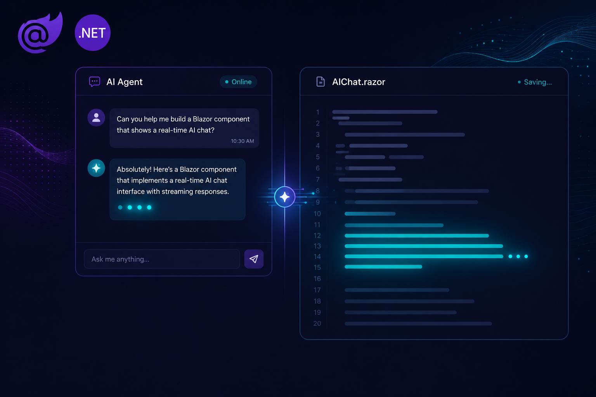
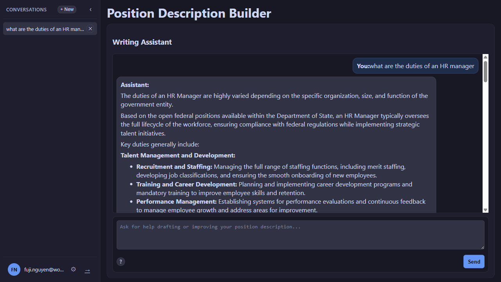

# AI Agent UI with Blazor United & .NET 10 — Blog Series

Series: AI Agent UI with Blazor United & .NET 10
GitHub: workcontrolgit/DotnetAiAgentUiTutorial

---

## Your .NET Skills Are Your UI Superpower

You already know C#. You already know dependency injection, async/await, and how to structure a .NET solution that does not collapse under its own weight. If you worked through Series 1, you also know how to build an MCP server, wire up `IChatClient`, and expose domain logic to an AI agent.

That backend is done. It works. The agent can answer HR questions, draft position descriptions, and export documents — all from the command line.

But no user ever opened a terminal and called it a product.

This series is the second half of the stack. We take the MCP server and AI agent we built in Series 1 and put a real user interface in front of them. A split-panel Blazor app: chat on the left, a live document editor on the right, a download button that produces a Word file, and OIDC authentication that locks the workspace to authorized users.

No React. No Angular. No TypeScript build toolchain. No context-switching between two languages and two runtimes.

Everything is C#, everything runs on .NET 10, and everything you build here plugs directly into the backend you already have.

---

## The Problem This Series Solves

Building an AI Agent UI is harder than it looks.

The UI has to handle streaming — tokens arriving one at a time from an async enumerable, each one triggering a partial re-render without freezing the browser. It has to manage conversation state across component boundaries without prop-drilling through five levels of Razor markup. It has to host a WYSIWYG editor that receives agent output as HTML, lets the user edit it inline, then serializes it back out as a Word document via an MCP tool call and a JS interop file download. And it has to do all of that behind an OIDC authentication layer that does not break the local development loop.

Every one of those problems has a clean solution in the .NET ecosystem. But no single tutorial shows you all of them together, in one app, wired end to end.

That is what this series does.

---

## What You Will Build

The application is a **Position Description Builder** — a Blazor United web app that helps HR professionals draft federal job descriptions using an AI Writing Assistant.

The layout is a split panel. On the left: a chat interface where the user talks to the AI agent, asks it to draft a position description, and refines the output through conversation. On the right: a WYSIWYG editor where the agent's output appears, the user can edit it directly, and an export dropdown downloads the finished document as Word (.docx), Markdown (.md), or JSON (.json). A collapsible conversation sidebar and a settings modal round out the shell.

Under the hood:

- The Blazor app is a single `HrMcp.Agent` project. By default `dotnet run` starts the web UI; pass `--console` to run the terminal agent instead. The same binary that ran as a console agent in Series 1 now hosts a full web UI.
- The chat panel calls `IAgentDraftService`, which talks to `IChatClient`, which reaches the Series 1 MCP server over Streamable HTTP.
- Streaming is real: `CompleteStreamingAsync` pushes tokens through `IAsyncEnumerable`, each token triggers a `StateHasChanged`, and the user watches the draft appear word by word.
- The Word export calls the MCP server's `ExportDraftToWord` tool and delivers the file as a browser download via JS interop — no server-side file storage required.
- OIDC authentication is gated behind a feature flag so local development stays fast and auth turns on exactly once for staging or production.

The domain is the same federal HR domain from Series 1 — USAJobs-aligned position data, OPM qualifications text, GS pay grades. But the patterns generalize. Swap the domain, keep the architecture.

---

## What You Will Learn

This is not a survey of Blazor features. Every skill listed here is exercised through working code you write yourself.

**Blazor United Auto render mode and when to use it**  
Why Auto mode is the right choice for AI chat UIs, how SSR prerendering gives you fast initial loads, and where SignalR interactivity takes over. When WASM kicks in and when it does not matter.

**MudBlazor 8 component model for AI chat interfaces**  
How to compose `MudPaper`, `MudStack`, `MudTextField`, and `MudIconButton` into a chat panel that looks professional without writing CSS from scratch. How the MudBlazor theme system gives you light/dark mode and brand colors in one config object.

**`IChatClient` abstraction and the provider-swap pattern**  
How `Microsoft.Extensions.AI`'s `IChatClient` keeps every component and service ignorant of which model is running. How `appsettings.json` is the only file that changes when you switch from Ollama to Azure OpenAI to any other provider.

**Token-by-token streaming and Blazor's rendering loop**  
How `CompleteStreamingAsync` returns `IAsyncEnumerable<StreamingChatCompletionUpdate>` and how to iterate it inside a Blazor component without deadlocking the render thread. How `StateHasChanged` + `InvokeAsync` lets you push partial updates from a background async loop.

**WYSIWYG editor integration with `Blazored.TextEditor`**  
How to install Quill inside a Blazor United app, load CDN assets in the right order, and drive the editor's content from C# rather than JavaScript. How `DraftDocumentState` carries revision state so the component knows when to reload the editor without diffing HTML strings.

**Word export via MCP tool calls and JS interop file download**  
How `ExportDraftToWordAsync` calls the MCP server's `ExportDraftToWord` tool and receives raw `byte[]`. How JS interop turns those bytes into a `Blob` and triggers a browser download — no temp files, no server-side storage, no file path shenanigans.

**OIDC client credentials flow in a Blazor app**  
How to implement the OAuth 2.0 client credentials flow in `AgentDraftService`, gate the entire auth path behind a feature flag, and attach `Authorization: Bearer <token>` to outbound MCP HTTP requests. How to swap Duende IdentityServer for Okta or Azure Entra ID with two config values.

---

## How This Connects to Series 1

Series 2 is the UI layer on top of Series 1's backend. The two series build one full-stack application across twelve posts.

The MCP server from [Series 1 Parts 1–3](../series-1-ai-agent-mcp/preface.md) is the data and tool layer. It exposes HR domain operations — position lookup, draft generation, Word export — as MCP tools that the AI agent can call. We do not touch the MCP server in this series. It is already done.

The `IChatClient` and Ollama setup from Series 1 Part 4 is the AI layer. `CompleteStreamingAsync`, the manual tool loop, the provider-swap pattern — all of that is already in place. This series calls it from Blazor components instead of from a console loop.

The OIDC security from Series 1 Part 6 is the server-side auth gate. The MCP server requires a bearer token. This series implements the client side: token acquisition, header injection, and the feature flag that keeps local dev fast.

**If you completed Series 1:** clone the Series 2 repo and continue. Your MCP server is the backend.

**If you are starting here:** clone the Series 2 companion repository. It includes the complete Series 1 MCP server as a sibling project, so you get the full stack from a single `git clone`.

---

## The Series at a Glance

- **[Preface](https://medium.com/scrum-and-coke/ai-agent-ui-with-blazor-united-net-10-series-preface-2915c25fe566)** — Series Overview: Context, goals, prerequisites
- **Part 1** — [Blazor United Foundation](https://medium.com/scrum-and-coke/part-1-blazor-united-foundation-525944403001): Solution scaffold, MudBlazor layout, routing
- **Part 2** — [AI Agent UI Patterns](https://medium.com/scrum-and-coke/part-2-ai-agent-ui-patterns-12449cfb4afb): `IChatClient`, `ChatTurn`, state model, `IAgentDraftService`
- **Part 3** — [Building the Chat UI](https://medium.com/scrum-and-coke/part-3-building-the-chat-ui-621de114b954): Chat component, message turns, MCP pipeline wired
- **Part 4** — [Real-Time UX & Session Persistence](https://medium.com/scrum-and-coke/part-4-real-time-ux-session-persistence-15ba4a2ddcbe): Loading states, session persistence, draft intelligence
- **Part 5** — [Document Editor & Word Export](https://medium.com/scrum-and-coke/part-5-document-editor-word-export-56cf152fc7b5): Split-panel layout, WYSIWYG editor, Word export
- **Part 6** — [Securing the UI with OIDC](https://medium.com/scrum-and-coke/part-6-securing-the-ui-with-oidc-7308cb893cbe): Client credentials flow, bearer token injection, feature flag

---

## Prerequisites

You will get the most from this series if you are comfortable with:

- **C# and .NET** — classes, interfaces, async/await, dependency injection
- **ASP.NET Core basics** — `WebApplication.CreateBuilder`, middleware, configuration
- **Series 1 recommended but not required** — the "How This Connects to Series 1" section above recaps everything you need

You do not need prior Blazor experience. Render modes, component lifecycle, and Razor syntax are introduced from scratch as each concept becomes relevant.

**Tools you will need:**

- **.NET 10 SDK** — `dotnet --version` should show 10.x or later
- **Ollama** — free local LLM runtime; download from [ollama.com](https://ollama.com) — run `ollama pull gemma4:latest` after install
- **Node.js 22+** — optional; only needed for MCP Inspector if you want to debug the MCP server directly
- **Git** — for cloning the companion repository

---

## The Companion Repository

Every code listing in this series is in the companion GitHub repository. You can clone it and follow along, or read the posts and build from scratch — both paths arrive at the same working application.

→ **[github.com/workcontrolgit/DotnetAiAgentUiTutorial](https://github.com/workcontrolgit/DotnetAiAgentUiTutorial)**

---

## Related Series

- [AI Agents & MCP with .NET 10](../series-1-ai-agent-mcp/preface.md) — the MCP server and agent backend this UI connects to

---

*Ready? Start with Part 1.*

→ **[Part 1: Blazor United Foundation](https://medium.com/scrum-and-coke/part-1-blazor-united-foundation-525944403001)**

*Tags: .NET, Blazor, AI, MudBlazor, Agent UI, MCP*
