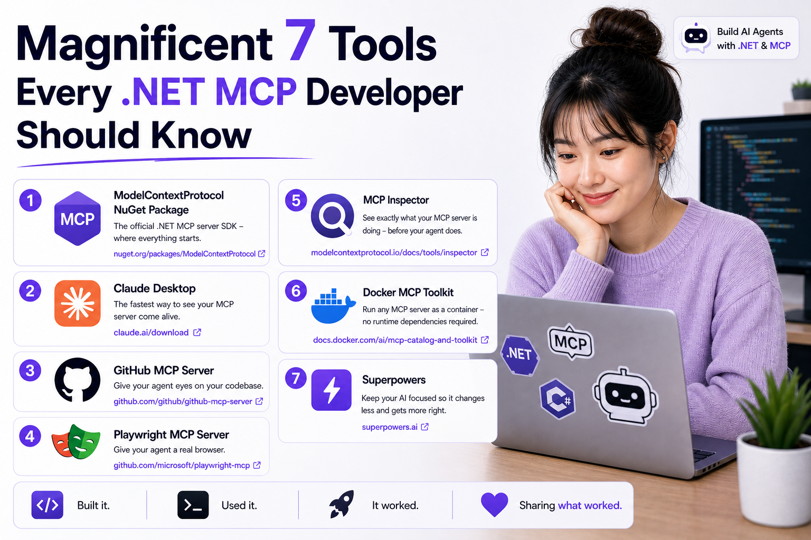
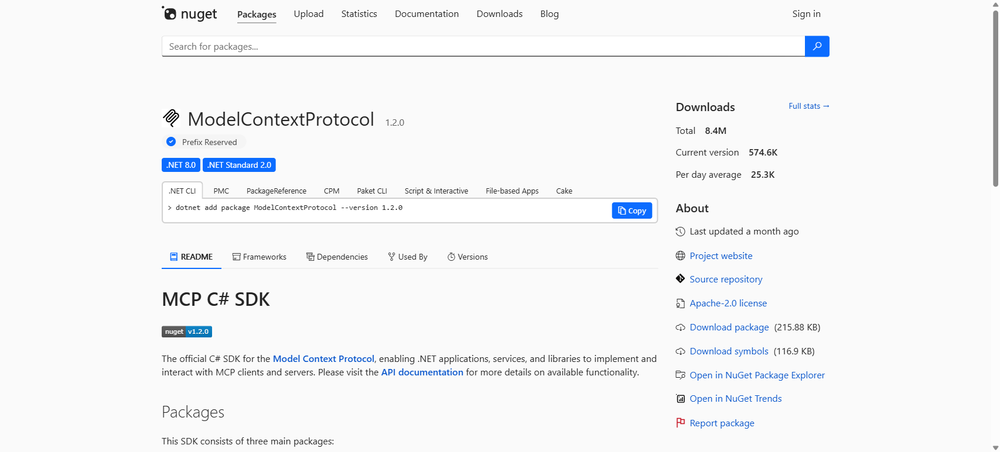
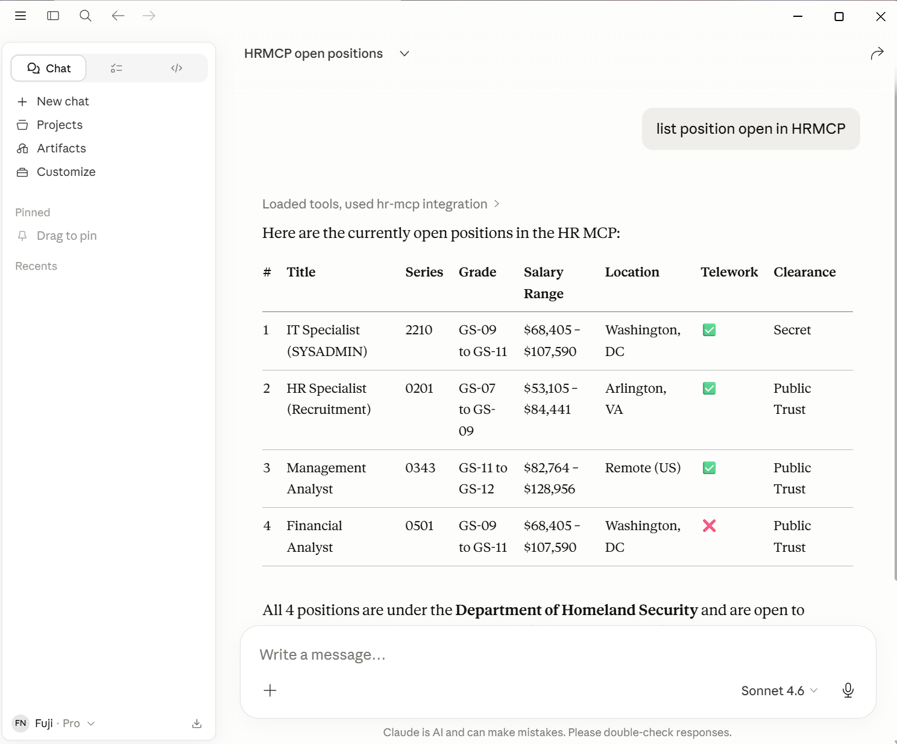
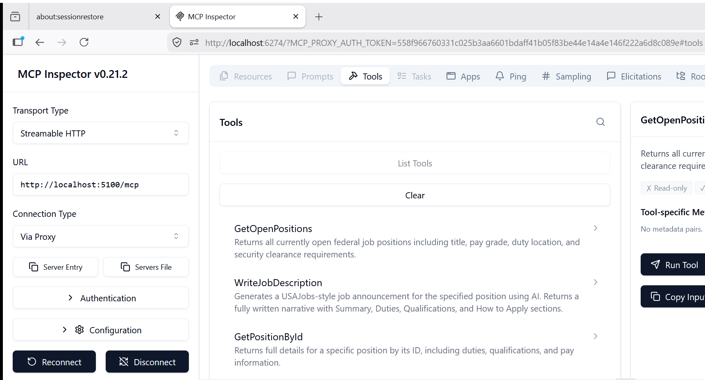
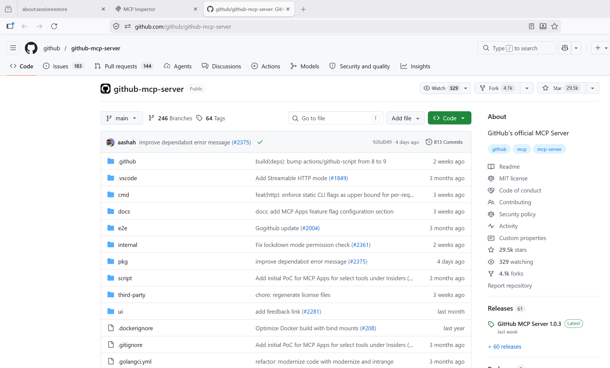
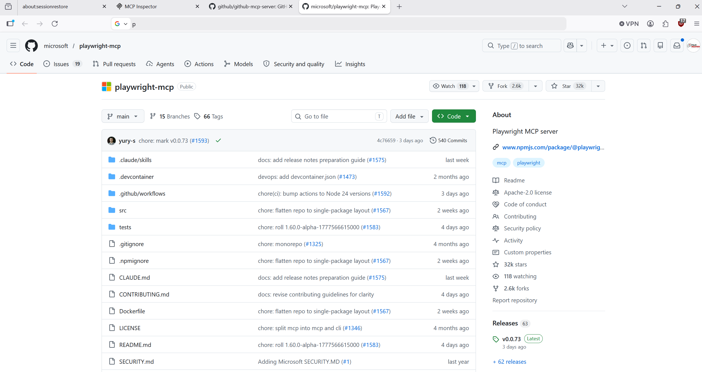
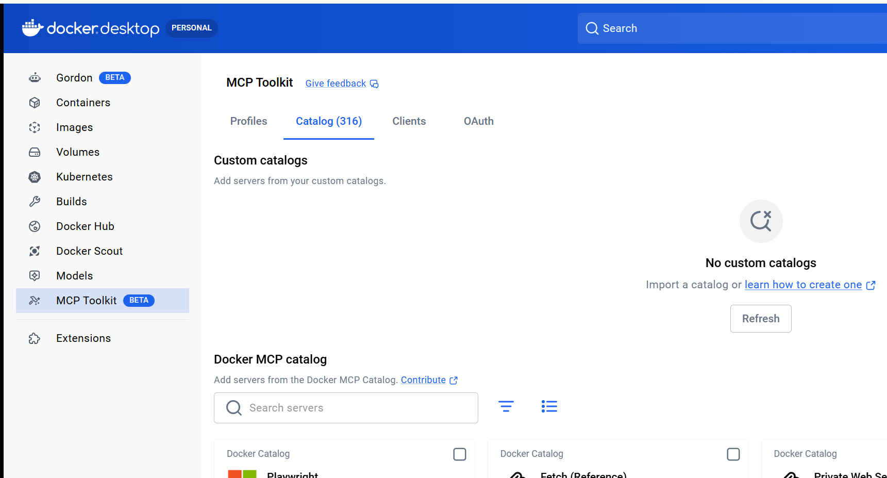
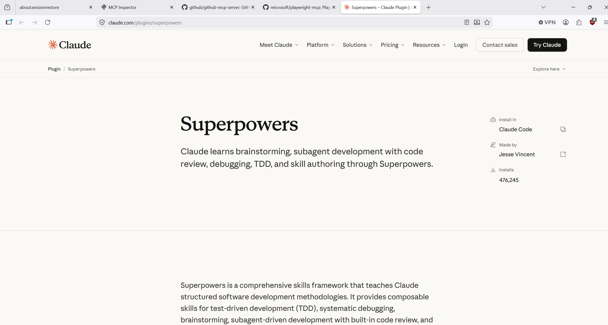

# Magnificent 7 Tools Every .NET MCP Developer Should Know

I've been building out an AI Agent + MCP blog series in .NET 10, and these are the tools I actually used while putting it together. Not tools I bookmarked. Not tools I plan to try later. These are the ones that were part of the real build.

The series starts here if you want the full context: [AI Agents & MCP with .NET 10 - Preface](https://medium.com/scrum-and-coke/ai-agents-mcp-with-net-10-preface-64314313e3e7).

Think of MCP like WiFi. The 802.11 standard defines how devices connect — everyone agrees on the protocol. But what makes WiFi actually useful are the things around it: the routers that serve the signal, the drivers that speak the protocol, and the apps that go online. Without those, the standard is just a spec on paper.

Here's the MCP stack I connected to while building the series.

---

## 1. ModelContextProtocol NuGet Package

**The official .NET MCP server SDK - where everything starts.**

This is the Microsoft-maintained NuGet package for building spec-compliant MCP servers in .NET. Attribute-based tool registration, stdio and SSE transports out of the box, and minimal boilerplate. Your tools are just C# methods decorated with `[McpServerTool]`.

I used this to expose an HR query service as an MCP server. The LLM called it like a function. That moment changed how I think about AI integrations entirely.

**Install:** `dotnet add package ModelContextProtocol`

---

## 2. Claude Desktop

**The fastest way to see your MCP server come alive.**

Claude Desktop is an MCP host. Point it at your server via `claude_desktop_config.json` and it wires up your tools automatically - no agent code, no client boilerplate. It's the fastest feedback loop I've found for MCP development.

I had a Claude Desktop session calling my locally-running .NET MCP server in under 10 minutes. It felt like cheating. If you're building an MCP server and haven't tested it here yet, you're missing out.

**Get it:** [claude.ai/download](https://claude.ai/download)

---

## 3. MCP Inspector

**See exactly what your MCP server is doing - before your agent does.**

MCP Inspector is a browser-based visual debugger for MCP servers. Connect it to any running server and it lists all available tools, lets you invoke them manually, and shows the full JSON-RPC traffic in real time. It's the first thing I open after `dotnet run`.

I caught a malformed tool description that would have confused the LLM - spotted it immediately in the Inspector's tool list. Saved me an hour of prompt debugging that I didn't even know I was about to do.

**Get it:** `npx @modelcontextprotocol/inspector`

---

## 4. GitHub MCP Server

**Give your agent eyes on your codebase.**

This is an official MCP server from GitHub that exposes repos, issues, PRs, code search, and file contents as MCP tools. Your AI agent can search issues, read source code, and summarize PRs - without a single API call baked into your app code. The MCP host handles authentication.

I asked it to create a Pull Request from develop into master and it created a PR with great detail — with a link I could go straight to and approve.

**Get it:** [github.com/github/github-mcp-server](https://github.com/github/github-mcp-server)

---

## 5. Playwright MCP Server

**Give your agent a real browser.**

Playwright MCP wraps the Playwright browser automation library as an MCP server. Navigation, screenshots, clicking, form filling, DOM inspection - all exposed as MCP tools. Your .NET agent doesn't need to know a thing about browsers.

I used it to automate end-to-end testing of a web frontend that calls my MCP-backed agent — navigate to the page, submit a query, screenshot the result. Two MCP tool calls. No Selenium setup, no browser driver config, no headache.

**Get it:** [github.com/microsoft/playwright-mcp](https://github.com/microsoft/playwright-mcp)

---

## 6. Docker MCP Toolkit

**Run any MCP server as a container - no runtime dependencies required.**

Docker's MCP Toolkit lets you run MCP servers as Docker containers. Browse a catalog of pre-built servers, pull one down, and it runs isolated - no Node.js, Python, or other runtimes to install on your machine.

I needed file access for my agent and Desktop Commander was the right fit - but it runs outside my .NET stack. With Docker MCP Toolkit I had it running in two commands. No virtual environments, no version conflicts, no friction.

**Get it:** [docs.docker.com/ai/mcp-catalog-and-toolkit](https://docs.docker.com/ai/mcp-catalog-and-toolkit/)

---

## 7. Superpowers

**Keep your AI focused so it changes less and gets more right.**

Superpowers is a Claude Code plugin that adds structure and execution discipline to Claude by constraining context, guiding tool usage, and encouraging stepwise task decomposition. It helps keep the model focused on the right files and reduces drift that leads to unnecessary rewrites.

That matters a lot when building an MCP server and agent together. In this series I was moving across Clean Architecture layers, local model setup, Claude Desktop integration, and OIDC security. Superpowers helped keep the work scoped so I could make targeted progress instead of letting the AI churn through half the repo.

**Get it:** [claude.com/plugins/superpowers](https://claude.com/plugins/superpowers)

---

These tools aren't the whole MCP ecosystem - it's growing fast. But they're the ones I actually used while building the AI Agent + MCP series, and they're the ones that made MCP stop feeling like a spec to me and start feeling like a platform.

If you want to see them in action together, start with the series preface here: [AI Agents & MCP with .NET 10 - Preface](https://medium.com/scrum-and-coke/ai-agents-mcp-with-net-10-preface-64314313e3e7). From there you can jump into Part 1 and the rest of the build.

---

*Tags: .NET, AI, MCP, Model Context Protocol, Software Development*
