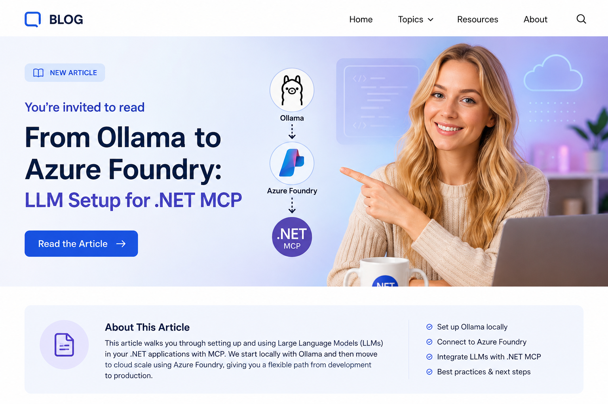

# From Ollama to Azure Foundry: LLM Setup for .NET MCP



## About This Article

This is a companion guide to the blog series **[AI Agents & MCP with .NET 10](https://medium.com/scrum-and-coke/ai-agents-mcp-with-net-10-preface-64314313e3e7)**.

The series walks through building a production-ready AI-enabled backend using .NET 10 and Clean Architecture — from a federal HR domain data model through a Model Context Protocol (MCP) server, an AI agent using `Microsoft.Extensions.AI`, Claude Desktop integration, and OIDC security. All code is in the [workcontrolgit/DotnetAiAgentMcp](https://github.com/workcontrolgit/DotnetAiAgentMcp) GitHub repo.

**The series uses Ollama with llama3.2 as the default LLM** — a local, zero-cost setup that works without any cloud account. This article is for readers who have followed the series (or cloned the repo) and want to swap from local Ollama to Azure Foundry backed Azure OpenAI for cloud-hosted inference.

You do not need to have read the full series. If you have the repo cloned and running locally, this guide is self-contained.

---

This project already supports two LLM providers:

- `Ollama` for local development
- `AzureOpenAI` for Azure-hosted models

The switch is controlled by the `AI:Provider` setting in app configuration. If `AI:Provider` is set to `Ollama`, the app uses the local Ollama endpoint. If it is set to any other value, the app expects Azure OpenAI settings and creates an `AzureOpenAIClient`.

This post shows how to move the project from local Ollama to Azure Foundry backed Azure OpenAI, using both the repo's Bicep and Azure CLI.

---

## Where This Repo Already Supports Azure

The Azure path is already wired into both runtime entry points:

- [DotnetAiAgentMcp/src/HrMcp.Agent/Program.cs](https://github.com/workcontrolgit/DotnetAiAgentMcp/blob/main/src/HrMcp.Agent/Program.cs)
- [DotnetAiAgentMcp/src/HrMcp.McpServer/Program.cs](https://github.com/workcontrolgit/DotnetAiAgentMcp/blob/main/src/HrMcp.McpServer/Program.cs)

The Bicep files for provisioning the Azure OpenAI resource and model deployment are here:

- [DotnetAiAgentMcp/infra/azure/main.bicep](https://github.com/workcontrolgit/DotnetAiAgentMcp/blob/main/infra/azure/main.bicep)
- [DotnetAiAgentMcp/infra/azure/main.parameters.json](https://github.com/workcontrolgit/DotnetAiAgentMcp/blob/main/infra/azure/main.parameters.json)

The current Bicep defaults in this repo are:

- Resource type: `Microsoft.CognitiveServices/accounts`
- Account kind: `OpenAI`
- API version: `2024-10-01`
- Deployment name: `gpt-4.1-mini`
- Model name: `gpt-4.1-mini`
- Model version: `2025-04-14`
- Deployment SKU: `GlobalStandard`
- Capacity: `1`

That means most of the Azure integration work is already done. The remaining steps are:

1. Create the Azure resource.
2. Deploy a model.
3. Capture endpoint, deployment name, and key.
4. Put those values into `.NET user-secrets`.

---

## App Settings Shape

This is the effective configuration shape the app expects:

```json
{
  "AI": {
    "Provider": "AzureOpenAI",
    "AzureOpenAI": {
      "Endpoint": "https://your-resource-name.openai.azure.com/",
      "Deployment": "gpt-4.1-mini",
      "ApiKey": "YOUR_AZURE_OPENAI_KEY"
    },
    "Ollama": {
      "Endpoint": "http://localhost:11434",
      "Model": "llama3.2"
    }
  }
}
```

If you want Ollama active but still want Azure values preloaded, keep the same JSON and change only:

```json
"Provider": "Ollama"
```

---

## Option 1: Provision With The Repo's Bicep

The Bicep in this repo creates:

- an Azure OpenAI account
- a model deployment inside that account

Update the parameter file first:

```json
{
  "$schema": "https://schema.management.azure.com/schemas/2019-04-01/deploymentParameters.json#",
  "contentVersion": "1.0.0.0",
  "parameters": {
    "accountName": {
      "value": "replace-with-foundry-openai-name"
    },
    "deploymentName": {
      "value": "gpt-4.1-mini"
    },
    "modelName": {
      "value": "gpt-4.1-mini"
    },
    "modelVersion": {
      "value": "2025-04-14"
    },
    "deploymentSkuName": {
      "value": "GlobalStandard"
    },
    "deploymentCapacity": {
      "value": 1
    }
  }
}
```

Then deploy it from Azure CLI:

```powershell
$resourceGroup = "dotnetmcp-aoai-rg"
$location = "eastus"

az group create `
  --name $resourceGroup `
  --location $location

az deployment group create `
  --resource-group $resourceGroup `
  --template-file .\DotnetAiAgentMcp\infra\azure\main.bicep `
  --parameters .\DotnetAiAgentMcp\infra\azure\main.parameters.json
```

After deployment, get the endpoint:

```powershell
az cognitiveservices account show `
  --name <your-account-name> `
  --resource-group $resourceGroup `
  --query "properties.endpoint" `
  --output tsv
```

Get the key:

```powershell
az cognitiveservices account keys list `
  --name <your-account-name> `
  --resource-group $resourceGroup `
  --query "key1" `
  --output tsv
```

List model deployments:

```powershell
az cognitiveservices account deployment list `
  --name <your-account-name> `
  --resource-group $resourceGroup `
  --output table
```

---

## Option 2: Provision Directly With Azure CLI

If you don't want to use the repo Bicep, create the resource and deployment directly.

Create the resource group:

```powershell
$resourceGroup = "dotnetmcp-aoai-rg"
$location = "eastus"
$accountName = "dotnetmcp-foundry-openai"
$deploymentName = "gpt-4.1-mini"

az group create `
  --name $resourceGroup `
  --location $location
```

Create the Azure OpenAI resource:

```powershell
az cognitiveservices account create `
  --name $accountName `
  --resource-group $resourceGroup `
  --location $location `
  --kind OpenAI `
  --sku S0 `
  --custom-domain $accountName `
  --yes
```

Create the model deployment:

```powershell
az cognitiveservices account deployment create `
  --name $accountName `
  --resource-group $resourceGroup `
  --deployment-name $deploymentName `
  --model-name "gpt-4.1-mini" `
  --model-version "2025-04-14" `
  --model-format OpenAI `
  --sku-capacity 1 `
  --sku-name "GlobalStandard"
```

Retrieve the endpoint:

```powershell
az cognitiveservices account show `
  --name $accountName `
  --resource-group $resourceGroup `
  --query "properties.endpoint" `
  --output tsv
```

Retrieve the primary key:

```powershell
az cognitiveservices account keys list `
  --name $accountName `
  --resource-group $resourceGroup `
  --query "key1" `
  --output tsv
```

Check the deployment:

```powershell
az cognitiveservices account deployment show `
  --name $accountName `
  --resource-group $resourceGroup `
  --deployment-name $deploymentName
```

Note: model availability, version, and deployment SKU can vary by region and subscription quota. If `gpt-4.1-mini` or `GlobalStandard` is rejected, verify the currently available model and SKU in your target region before changing the Bicep or CLI command.

---

## Update .NET User-Secrets

This repo already uses `UserSecretsId` in both projects:

- `DotnetAiAgentMcp-HrMcp-McpServer`
- `DotnetAiAgentMcp-HrMcp-Agent`

Set secrets for the MCP server:

```powershell
dotnet user-secrets set "AI:Provider" "AzureOpenAI" --project .\DotnetAiAgentMcp\src\HrMcp.McpServer
dotnet user-secrets set "AI:AzureOpenAI:Endpoint" "https://your-resource-name.openai.azure.com/" --project .\DotnetAiAgentMcp\src\HrMcp.McpServer
dotnet user-secrets set "AI:AzureOpenAI:Deployment" "gpt-4.1-mini" --project .\DotnetAiAgentMcp\src\HrMcp.McpServer
dotnet user-secrets set "AI:AzureOpenAI:ApiKey" "YOUR_AZURE_OPENAI_KEY" --project .\DotnetAiAgentMcp\src\HrMcp.McpServer
```

Set secrets for the agent:

```powershell
dotnet user-secrets set "AI:Provider" "AzureOpenAI" --project .\DotnetAiAgentMcp\src\HrMcp.Agent
dotnet user-secrets set "AI:AzureOpenAI:Endpoint" "https://your-resource-name.openai.azure.com/" --project .\DotnetAiAgentMcp\src\HrMcp.Agent
dotnet user-secrets set "AI:AzureOpenAI:Deployment" "gpt-4.1-mini" --project .\DotnetAiAgentMcp\src\HrMcp.Agent
dotnet user-secrets set "AI:AzureOpenAI:ApiKey" "YOUR_AZURE_OPENAI_KEY" --project .\DotnetAiAgentMcp\src\HrMcp.Agent
```

If you want to inspect the stored values:

```powershell
dotnet user-secrets list --project .\DotnetAiAgentMcp\src\HrMcp.McpServer
dotnet user-secrets list --project .\DotnetAiAgentMcp\src\HrMcp.Agent
```

---

## Example With Both Ollama And Azure Configured

This is a practical example where both providers are configured but Azure is active:

```json
{
  "AI": {
    "Provider": "AzureOpenAI",
    "AzureOpenAI": {
      "Endpoint": "https://dotnetmcp-foundry-openai.openai.azure.com/",
      "Deployment": "gpt-4.1-mini",
      "ApiKey": "***redacted***"
    },
    "Ollama": {
      "Endpoint": "http://localhost:11434",
      "Model": "llama3.2"
    }
  }
}
```

To switch back to local inference, keep everything else and change only:

```json
{
  "AI": {
    "Provider": "Ollama"
  }
}
```

---

## Estimated Cost For One Developer On S0

For this repo, the `S0` setting in the Bicep is the account SKU for the Azure OpenAI resource. For standard Azure OpenAI usage, the practical cost driver is usually token consumption, not a dedicated always-on compute charge. Microsoft’s pricing guidance distinguishes between:

- standard pricing charged by token usage
- provisioned deployments charged at an hourly rate

This repo’s default deployment path uses a standard deployment model with `GlobalStandard`, so for a single developer the monthly cost is usually dominated by prompt volume, response size, and how often the agent is used during the day.

### Practical estimate

For one developer using `gpt-4.1-mini` on an `S0` Azure OpenAI account:

- light usage: about `$5-$15/month`
- moderate daily development usage: about `$15-$50/month`
- heavy agent-driven usage with long prompts and long responses: `$50+/month`

These are not quoted Azure prices. They are working estimates based on typical solo developer usage patterns:

- short chat and tool prompts
- moderate code generation and summarization
- no large batch processing
- no high-volume automation loops
- one active developer, not a team

### A simple planning model

If you want a rough planning model, think in terms of monthly token volume:

- low usage: under `10M` total tokens/month
- moderate usage: `10M-40M` total tokens/month
- heavy solo usage: `40M+` total tokens/month

Your actual bill depends on the current Azure rate for:

- input tokens
- cached input tokens, if used
- output tokens
- deployment type such as `GlobalStandard`, `Standard`, or regional options

### Recommendation

For one developer, start with:

- `gpt-4.1-mini`
- `GlobalStandard`
- one deployment
- budget alert at `$25` or `$50` per month

That is usually enough to validate the Azure path without overcommitting cost.

### How to verify current pricing before rollout

Before a team rollout, verify the actual current rate in the Azure pricing page and pricing calculator for your subscription, region, and deployment type. Pricing for Azure OpenAI can vary by model and deployment mode, and Microsoft updates pricing independently of this repo.

---

## Recommended Flow For This Repo

For this codebase, the cleanest setup path is:

1. Use [DotnetAiAgentMcp/infra/azure/main.bicep](https://github.com/workcontrolgit/DotnetAiAgentMcp/blob/main/infra/azure/main.bicep) to keep infrastructure repeatable.
2. Keep `deploymentName` aligned with the application setting `AI:AzureOpenAI:Deployment`.
3. Store endpoint and key in `.NET user-secrets`, not in committed `appsettings.json`.
4. Leave the Ollama section in place so local fallback remains easy.

That gives you a repeatable Azure Foundry setup without losing the local developer experience.

---

## References

- Repo Bicep: [DotnetAiAgentMcp/infra/azure/main.bicep](https://github.com/workcontrolgit/DotnetAiAgentMcp/blob/main/infra/azure/main.bicep)
- Repo parameters: [DotnetAiAgentMcp/infra/azure/main.parameters.json](https://github.com/workcontrolgit/DotnetAiAgentMcp/blob/main/infra/azure/main.parameters.json)
- Azure OpenAI resource creation in Azure AI Foundry Models: https://learn.microsoft.com/en-us/azure/ai-foundry/openai/how-to/create-resource?tabs=portal
- Azure CLI `az cognitiveservices account deployment`: https://learn.microsoft.com/en-us/cli/azure/cognitiveservices/account/deployment?view=azure-cli-latest
- Azure OpenAI cost management guidance: https://learn.microsoft.com/en-us/azure/ai-services/openai/how-to/manage-costs
- Azure OpenAI pricing: https://azure.microsoft.com/en-us/pricing/details/azure-openai/
- Bicep resource reference for `Microsoft.CognitiveServices/accounts`: https://learn.microsoft.com/en-us/azure/templates/microsoft.cognitiveservices/accounts
- Bicep resource reference for `Microsoft.CognitiveServices/accounts/deployments`: https://learn.microsoft.com/en-us/azure/templates/microsoft.cognitiveservices/2023-05-01/accounts/deployments
