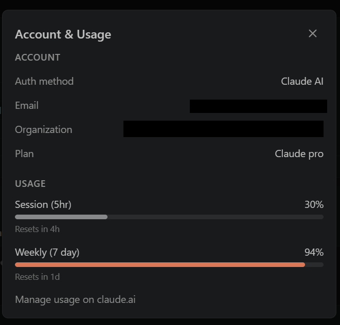
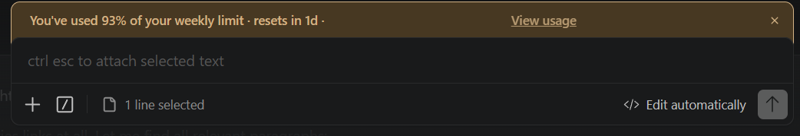

# Managing Claude Code Token Limits in a .NET + Angular + Playwright Stack

If you're building a modern full-stack app with .NET Web API, Angular, and Playwright, Claude Code in VS Code quickly becomes your most powerful productivity tool and your fastest way to hit usage limits.

After a few deep debugging sessions, you'll start seeing:

- Session usage climbing fast
- Weekly usage hitting 90%+
- Responses slowing or stopping

This isn't a bug. It's how token-based AI works.



*Example: account usage showing a 5-hour session meter and a weekly limit meter nearing the cap.*

## What Are You Actually Consuming?

Claude Code usage is measured in tokens, which include:

- Your input: prompts, instructions, and task framing
- Claude's output: responses
- Conversation history: context carried forward
- Repo context Claude reads while exploring relevant files

Every request reprocesses some or all of this.

## Why .NET + Angular + Playwright Burns Tokens Fast

### Full-Stack Context Explosion

A single issue often spans:

- Angular component and template
- .NET controller, service, and DTO
- JWT / IdentityServer configuration
- Playwright test files

Even when your repo is already indexed and you are not pasting code, token use still grows fast when the agent has to inspect many files, carry that context forward, and revisit the same areas across multiple turns.

### Playwright AI Loops Are Expensive

Typical flow:

1. Generate test
2. Run, then it fails
3. Share the failure
4. Ask to fix it
5. Repeat

Each loop means more file inspection, more context, and more token cost again.



*Example: the inline warning banner that appears when weekly usage is close to the limit.*

### Auth Debugging Is a Hidden Token Killer

OIDC / JWT issues usually require:

- Logs
- Config
- Multiple related files
- Redirect flows

These are high-context problems, which means high token usage.

## Where Tokens Get Burned

```text
[ Angular UI ]
      ->
[ .NET API ]
      ->
[ Auth Server (JWT) ]
      ->
[ Playwright Tests ]
```

Every layer you include adds more tokens.

Every retry repeats the cost.

## How I Reduce Token Usage

### 1. Slice by Layer

This is the biggest win.

Instead of asking Claude to scan Angular, the API, auth flow, and Playwright all at once, I break the work into steps:

```text
Step 1: Fix .NET token issue
Step 2: Fix Angular auth handling
Step 3: Fix Playwright test
```

That keeps the context narrow and usually leads to faster, cheaper iterations.

### 2. Scope Angular Work Aggressively

Angular templates are token-heavy, and Angular apps usually have many connected files. I get better results when I point Claude at the exact screen, guard, or callback path involved instead of asking it to roam through the whole module.

### 3. Narrow .NET Inspection

Claude does not need your entire Clean Architecture setup for every backend issue. If the problem is a missing claim, I keep the scope on the token endpoint, DTO, and claim-mapping code instead of tracing every layer.

### 4. Optimize Playwright Inputs

For Playwright, I usually share only:

- Failing step
- Error message
- Selector
- Relevant trace or screenshot if it materially helps

Example:

```ts
await page.click('#login'); // element not visible
```

### 5. Avoid Regeneration Loops

When a test fails, I try to keep Claude on the smallest correction first, like fixing a selector or wait condition, instead of asking it to rewrite the whole test.

### 6. Reset Chats Frequently

Each chat carries hidden context.

Use:

- Chat 1 for API
- Chat 2 for Angular
- Chat 3 for Playwright

A new chat is usually faster and cheaper.

### 7. Reuse a Compact Stack Prompt

```text
Stack:
- .NET Web API (Clean Architecture)
- Angular (Material)
- JWT auth (IdentityServer)
- Playwright E2E

Focus only on files directly related to the task.
Do not scan broadly unless required.
```

### 8. Use AI Where It Matters Most

Best ROI:

- Complex debugging
- Auth issues
- Playwright test generation
- Refactoring patterns

Avoid using it for:

- Minor UI tweaks
- Simple CRUD
- Formatting

## How I Personally Use OpenWolf and Superpowers

These two tools help me stay more disciplined when I am working with Claude Code for long sessions.

If you use Claude Code seriously, I think you should try the [Superpowers plugin](https://claude.com/plugins/superpowers). It has a lot of stars in the Claude AI plugin catalog, and for me the value is practical: it helps keep the AI focused, scoped, and less likely to rewrite code that is already fine.

With [OpenWolf](https://openwolf.com/), I rely on the project context so I do not have to keep reintroducing the same structure over and over. That helps when I am jumping between Angular, the API, auth, and Playwright and I want Claude to stay anchored to the right part of the repo.

With Superpowers, I use a more deliberate workflow. I want Claude to plan first, identify the smallest set of files that matter, and avoid wandering across the codebase unless there is a good reason. That usually means it can make a focused fix instead of rewriting code that does not need to change.

In practice, I think of it like this:

- OpenWolf helps with memory
- Superpowers helps keep changes focused so the AI does not rewrite code unnecessarily
- Claude Code does the actual execution

For example, if I am adding a Playwright login test, I want OpenWolf to keep the auth flow, routes, and test helpers in view. Then I use Superpowers to keep the task narrow so Claude focuses on the few files that actually matter instead of scanning everything around them or rewriting parts that are already working.

## Practical Prompt That Saves Tokens

```text
Use OpenWolf project context and Superpowers planning.
Do not scan the full repo.
Only inspect files directly related to this task.
Make the smallest safe change.
```

## Important Reminder

These tools help, but they do not eliminate limits.

You still need to:

- Keep requests narrowly scoped
- Split tasks by layer
- Avoid large logs and broad repo scans
- Reset chats

Tools improve efficiency, not quota.

## A Better Prompt Shape

This is the kind of prompt shape that tends to work well for me:

```text
Inspect only the API token endpoint and claim mapping.
The issued token is missing the role claim.
Ignore Angular and Playwright for this step.
```

Same problem, much less wasted context.

## Mental Model for This Stack

- Angular: template-heavy and expensive
- .NET: structured and moderate, but multi-layer tracing adds up
- Playwright: loop-heavy with hidden cost

The real issue is not one request. It is repetition plus context size.

## Final Takeaway

Claude Code is powerful, but not unlimited.

What has worked best for me is simple:

- Break problems into layers
- Narrow file inspection aggressively
- Avoid unnecessary retries
- Reset context often

That usually means faster responses, better answers, and more useful work before hitting limits.

In short:

> Don't give AI more than it needs. Give it exactly what it needs.

My current setup is a little defensive by design. Claude is my primary tool, and I use Codex as a backup when I start running out of tokens. More recently, I installed OpenCode and have been evaluating whether it works better as a backup to Claude than Codex does. I have not tried Gemini Code yet.

If you use a different setup, or if you have real-world experience with Gemini Code, add your tips in the comments and share what has worked for you.
